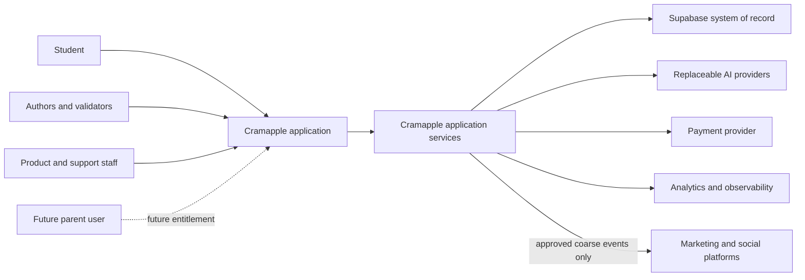
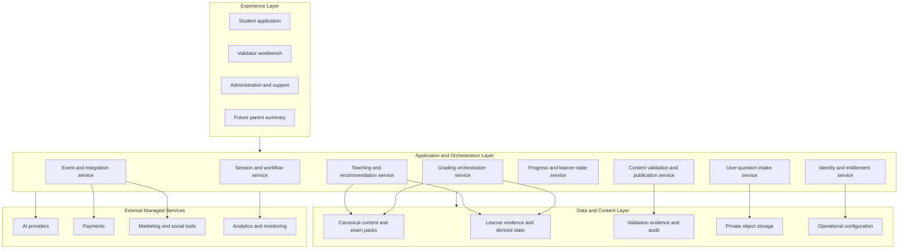

# Cramapple High-Level System Architecture

**Canonical planning draft | June 9, 2026 | v0.1**

## 1. Document Status

This document defines the proposed high-level technical architecture for Cramapple. It establishes system boundaries, responsibilities, information flows, quality controls, and extensibility principles. It is a planning artifact, not an implementation specification.

The architecture is designed around four priorities:

1. Maintain high teaching and grading quality.
2. Extend efficiently to additional AP exams.
3. Favor maintainable low-code and managed systems, including Lovable, Vercel, and Supabase.
4. Interoperate safely with marketing and lifecycle tools, especially social-media marketing systems.

Detailed designs are maintained separately. The system context and component model is defined in `SYSTEM_CONTEXT_AND_LOGICAL_COMPONENT_ARCHITECTURE.md`. Teaching behavior is defined in `../teaching/TEACHING_AND_PEDAGOGY_DESIGN.md`. A grading design remains a required follow-on artifact.

## 2. Scope

### 2.1 In Scope

- Student, validator, administrator, and future parent system boundaries.
- Critical end-to-end workflows.
- Logical components and ownership.
- Durable learner memory and progress.
- Teaching, grading, and shared-content boundaries.
- AI model-provider abstraction and structured-output controls.
- Validator entitlements, workbench, approval, and publication workflow.
- Marketing event interoperability.
- Security, privacy, auditability, reliability, and operations.
- AP-subject extensibility.
- MVP and deferred-capability boundaries.

### 2.2 Out of Scope

- Final database DDL and migration scripts.
- Final API contracts.
- Detailed teaching pedagogy.
- Detailed grading prompts, calibration thresholds, and scoring algorithms.
- Final vendor selection for every service.
- Screen-level product design.
- Production deployment or implementation.

## 3. Architecture Drivers

### 3.1 Teaching Quality

Cramapple must deliver instruction, hints, remediation, and recommendations that are accurate, comprehensible, aligned with AP expectations, and useful to the individual learner. Teaching behavior must be based on approved, versioned content and validated through an efficient expert workflow.

### 3.2 Grading Quality

Free-response grading is central to the product. Criterion-level decisions must be traceable to a versioned question and rubric package. The system must represent uncertainty, support escalation, retain evaluation provenance, and measure human-AI agreement.

### 3.3 Longitudinal Learning

Cramapple must remember prior sessions, attempts, errors, assistance used, and grading evidence. Durable evidence should support targeted review, account progress, and appropriately qualified improvement statements.

### 3.4 Extensibility

The shared platform should support multiple AP exams through versioned exam packs. Subject-specific knowledge, skills, question types, rubrics, and validators should be configurable without rebuilding identity, learner records, orchestration, validation, analytics, or marketing integration.

### 3.5 Low-Code Maintainability

Managed systems should reduce operational complexity without placing authoritative learning logic in a visual frontend. Lovable may accelerate interface development, Supabase may provide identity and durable data, and Vercel may host application and server-side orchestration.

### 3.6 Marketing Interoperability

The product should exchange consented lifecycle and attribution events with marketing systems. Detailed student responses, grading records, weaknesses, uploads, and progress narratives must remain inside the protected learning system.

## 4. Architecture Principles

- **Grading creates evidence; teaching selects the next learning action.**
- **Student attempts are durable; derived mastery and recommendations are rebuildable.**
- **Questions, rubrics, teaching artifacts, prompts, models, and evaluations are versioned.**
- **Approved canonical content is distinct from user-provided material.**
- **AI outputs are structured, attributable, reviewable, and uncertainty-aware.**
- **Frontend clients display authoritative state but do not calculate it.**
- **Model providers are replaceable behind task-specific interfaces.**
- **Human validation and calibration are part of the production system.**
- **Authorization is enforced server-side and in the database, not only in the UI.**
- **Payment eligibility and data authorization are separate decisions.**
- **Marketing receives the minimum approved event data.**
- **Every AP subject is an exam pack on a shared platform.**

## 5. Actors and External Systems

### 5.1 Actors

| Actor | Primary Need |
| --- | --- |
| Student | Learn, practice, receive feedback, resume work, and understand progress. |
| Content author | Create and revise versioned questions, lessons, hints, and rubric packages. |
| Teaching validator | Review scientific accuracy, pedagogy, clarity, and teaching behavior. |
| Grading validator | Independently score responses and validate criterion-level grading behavior. |
| Lead validator | Resolve disagreement and oversee calibration. |
| Release approver | Publish only versions that satisfy required gates. |
| Product administrator | Configure exams, assignments, entitlements, and operations. |
| Support operator | Resolve account and operational issues without unnecessary learning-data access. |
| Parent or guardian | Future paid access to an approved aggregate progress summary. |

### 5.2 External Systems

| System | Intended Role |
| --- | --- |
| Lovable | Low-code student and internal-workbench interface development. |
| Vercel | Web hosting, server-side application routes, orchestration, scheduled work, and secure provider calls. |
| Supabase | Authentication, PostgreSQL system of record, row-level security, storage, and managed backend capabilities. |
| AI model providers | Task-specific classification, teaching, extraction, grading support, and language generation behind Cramapple interfaces. |
| Payment provider | Subscription, add-on, refund, and commercial-eligibility events. |
| Product analytics | Approved product events and operational funnels. |
| Marketing automation | Consent-aware lifecycle messaging and audience synchronization. |
| Social platforms | Campaign attribution and approved conversion events. |
| Error and observability systems | Logs, traces, alerts, model-quality monitoring, and operational dashboards. |

## 6. System Context



The Cramapple application is the only product surface exposed to users. External AI, marketing, analytics, and payment systems do not receive direct access to protected learning tables.

## 7. Critical Workflow Map

| Workflow | Outcome | MVP Position |
| --- | --- | --- |
| Sign up and start learning | A new learner reaches useful instruction or practice quickly. | Required |
| Resume learning | A returning learner continues with relevant history and recommendations. | Required |
| Select or receive recommended practice | The learner chooses or accepts an explained next action. | Required |
| Complete instruction and practice | Approved teaching content and meaningful interactions are delivered and recorded. | Required |
| Submit and grade work | MCQ, quantitative, and free-response work receives appropriate feedback. | Required |
| Accept, teach, and grade a user-provided question | An outside question receives qualified teaching, hints, solutions, or work checking. | Account for; stage as feasible |
| Update learner history and recommendations | Durable evidence updates derived learner state and future review priorities. | Required |
| View account progress | The learner sees effort, grading evidence, improvement, and next actions. | Required at useful minimum |
| View parent progress summary | A linked and entitled parent sees an approved aggregate summary. | Future paid feature |
| Author, validate, and publish content | Versioned artifacts pass teaching and grading gates before release. | Required internal capability |
| Monitor and improve quality | Production defects and drift trigger investigation and revalidation. | Required |
| Exchange approved marketing events | Consented lifecycle and attribution events support acquisition and retention. | Required at useful minimum |

### 7.1 Sign Up and Start Learning

```text
Landing or invitation
  -> Create account or authenticate
  -> Resolve consent and age-related state
  -> Create learner profile
  -> Select AP exam, resolve its official date, and confirm learner registration
  -> Capture immediate goal and available time
  -> Choose optional calibration, requested topic, or direct practice
  -> Create first learning session
  -> Deliver approved instruction or practice
  -> Persist first learning evidence
```

The first useful action should not depend on completing a long profile. Interrupted onboarding must be recoverable. A diagnostic is optional.

### 7.2 Resume Learning

```text
Authenticate or restore session
  -> Load active exam and learner state
  -> Retrieve incomplete work, recent attempts, and due review
  -> Generate eligible next actions
  -> Explain the highest-value recommendation
  -> Resume, accept recommendation, or choose another topic
  -> Persist new evidence and update future recommendations
```

The system must distinguish incomplete interactions from completed attempts, work across devices, and degrade safely to topic selection if history is unavailable.

### 7.3 Select, Teach, Practice, and Grade

The teaching system selects approved content or practice based on learner intent, available time, exam importance, prerequisite relationships, and prior evidence. The grading system evaluates submitted work and returns structured criterion results. The learner record then stores the evidence and recalculates future priorities.

### 7.4 Accept, Teach, and Grade a User-Provided Question

Students commonly arrive with a question from school, a review guide, a search engine, Reddit, or another online source.

Supported intake may eventually include:

- Typed or pasted text.
- Photographs, screenshots, or documents.
- Answer choices, diagrams, tables, and equations.
- The learner's attempted answer.
- Teach, hint, solution, or check-my-work mode.

```text
Receive question and requested mode
  -> Validate upload and extract available content
  -> Detect missing context and sensitive information
  -> Classify exam, topic, skill, type, and canonical archetype
  -> Estimate classification and grading confidence
  -> Request clarification when needed
  -> Route to teaching, hint, solution, or grading
  -> Use approved canonical knowledge and methods
  -> Disclose uncertainty and limits
  -> Store permitted private evidence
  -> Keep submission isolated from canonical content
```

Grading behavior depends on the match:

- **Validated match:** Apply a versioned rubric package and provide criterion-level grading.
- **Partial match:** Assess supported elements and identify unverified elements.
- **No validated match:** Provide formative reasoning feedback, not an authoritative score.
- **Missing context:** Ask for more information or escalate rather than inventing details.

Uncertain external-question evidence should not carry the same learner-state weight as validated Cramapple questions.

### 7.5 View Account Progress

Account Progress separates effort from demonstrated learning.

- **Effort evidence:** Sessions completed, questions attempted, topics practiced, focused time, and recommended reviews completed.
- **Learning evidence:** Rubric criteria earned, recurring errors reduced, comparable-question performance, reduced hint dependence, delayed retention, and estimated readiness when supported.

```text
Open account progress
  -> Select exam and period
  -> Load activity and versioned grading evidence
  -> Calculate effort summaries
  -> Select comparable attempts
  -> Calculate qualified learning measures
  -> Display trends, evidence, and gaps
  -> Recommend the next useful action
```

The system should celebrate meaningful effort without presenting it as mastery. Progress claims must identify the evidence period and sample, remain inspectable, and disclose limitations.

### 7.6 View Parent Progress Summary

This is a future paid feature, not an MVP commitment. Payment alone never grants data access.

Required conditions:

- Verified parent or guardian account.
- Approved relationship to the learner.
- Active parent-progress product entitlement.
- Required consent, notice, and age-related legal state.
- A visibility policy defining shared fields.

The default view may include aggregate effort, topics practiced, progress trends, review priorities, and next actions. It should exclude raw conversations, full responses, uploads, private notes, and detailed interaction transcripts.

### 7.7 Author, Validate, and Publish

Teaching and grading validation are independent gates:

- Teaching validation evaluates accuracy, clarity, pedagogy, accessibility, remediation, and recommendation quality.
- Grading validation evaluates rubric defensibility and criterion-level behavior across representative responses.

Approval in one track does not imply approval in the other.

```text
Draft
  -> Ready for validation
  -> Assigned
  -> Independent review
  -> Approved | Changes requested | Rejected | Escalated
  -> New immutable version when revised
  -> Revalidation
  -> Required gates passed
  -> Release approval
  -> Published
  -> Sampled production revalidation
```

## 8. Logical Component Architecture



## 9. Component Responsibilities

### 9.1 Experience Layer

**Student application**

- Onboarding, session selection, lessons, practice, submissions, feedback, history, and progress.
- Displays authoritative server state and captures learner intent.
- Does not independently calculate mastery, grades, entitlements, or progress claims.

**Validator workbench**

- Prioritized assignment queues.
- Student-view teaching previews.
- Blind and criterion-level grading review.
- Structured findings, decisions, escalation, and audit history.

**Administration and support**

- Exam-pack configuration, operational status, assignments, approved account support, and incident controls.
- Uses separate privileges from validator and release-approval permissions.

**Future parent summary**

- Displays only approved aggregate fields after relationship, entitlement, consent, and visibility checks.

### 9.2 Application and Orchestration Layer

**Session and workflow service**

- Creates, resumes, and completes learning sessions.
- Maintains idempotency so retries do not duplicate attempts.
- Coordinates teaching, grading, learner-state, and event updates.

**Teaching and recommendation service**

- Selects approved instruction, hints, remediation, and next actions.
- Uses structured learner evidence and exam-pack relationships.
- Returns recommendation reason codes and learner-facing explanations.

**Grading orchestration service**

- Loads the exact question and rubric package.
- Calls appropriate evaluation tools or models.
- Validates structured output and applies confidence and escalation rules.
- Writes versioned evaluation evidence.

**User-question intake service**

- Handles text and future file intake.
- Extracts content, classifies the question, identifies missing context, and isolates user material from canonical content.
- Separates private learner use, anonymous internal improvement use, and separately gated public publication.
- Sweeps public candidates for the signed-in user's proper name variants and holds or removes matches.

**Progress and learner-state service**

- Rebuilds strength, difficulty, recurrence, confidence, and recency views.
- Selects comparable evidence and creates qualified progress statements.
- Persists support level, escalation route, immediate transfer, delayed retention, Move On, and Park state by skill and task type.

**Content validation and publication service**

- Manages artifact versions, review requirements, assignments, decisions, disagreements, and publication gates.

**Identity and entitlement service**

- Evaluates actor, role, scope, subject, artifact, environment, product access, relationship, and consent.
- Separates payment eligibility from data authorization.

**Event and integration service**

- Produces a controlled internal event stream.
- Maps approved events to analytics, lifecycle, payment, and social integrations.
- Removes or blocks sensitive learning payloads.

### 9.3 Data and Content Layer

**Canonical content and exam packs**

- Exam taxonomy, approved sources, teaching artifacts, questions, rubrics, accepted variants, misconceptions, samples, and approval records.

**Learner evidence**

- Sessions, attempts, responses, assistance used, criterion results, confidence, timing, and evaluation provenance.

**Anonymous improvement evidence**

- Deidentified responses, outcomes, validator corrections, and version provenance used to improve Cramapple's grading, teaching, content, evaluation sets, prompts, model configurations, and routing policies.
- Excludes identity, account, payment, parent, and direct-contact fields.
- Does not make a response public; publication requires a separate release decision.

**Derived learner state**

- Current summaries by concept, skill, criterion, question type, and exam pack.
- Rebuildable from durable evidence.

**Validation evidence**

- Qualifications, entitlements, assignments, cases, independent scores, decisions, disagreement, publication, and retirement history.

**Private object storage**

- User uploads, question assets, and internal validation assets with scoped access and retention controls.

## 10. Teaching and Grading Boundaries

| Concern | Teaching System | Grading System | Shared Contract |
| --- | --- | --- | --- |
| Primary question | What should the learner do next, and why? | What evidence did the response demonstrate, and how reliably? | Which approved artifact and learner evidence are in use? |
| Inputs | Learner intent, time, prior evidence, exam priorities, approved teaching content | Question version, rubric version, response, accepted variants, contradictions | Stable IDs, versions, skill taxonomy, provenance |
| Outputs | Instruction, hints, remediation, practice selection, next action | Criterion results, feedback, confidence, escalation status | Structured events and learner-evidence records |
| Human validation | Accuracy, pedagogy, clarity, accessibility, recommendation alignment | Rubric validity, boundary cases, human-AI agreement | Version-specific approval and audit |
| Failure behavior | Offer a safe alternative or request clarification | Withhold unsupported certainty and escalate | Preserve evidence and disclose limitation |

The grading system must not directly choose the learner's curriculum path. The teaching system must not invent or overwrite grading evidence.

## 11. Canonical Content and Exam Packs

Each AP exam pack should contain:

- Exam, module, topic, concept, skill, and question-type taxonomy.
- Approved source material and citations.
- Teaching explanations, examples, hints, and remediation patterns.
- Original questions and assets.
- Versioned rubric packages and accepted-answer variants.
- Misconceptions, insufficiency patterns, and contradictions.
- Question archetypes and prerequisite relationships.
- Validation cases and expert approval state.
- Subject-specific tools or rendering requirements.

The shared engine owns identity, sessions, attempts, orchestration, validation workflow, learner memory, progress, integrations, and operations.

## 12. Longitudinal Learner Memory

### 12.1 Durable Evidence

Store each meaningful attempt with:

- Learner, session, question, and response identifiers.
- Question, rubric, taxonomy, prompt, grading, and model versions.
- Criterion-level results and grader confidence.
- Hints, examples, retries, or solution exposure.
- Learner confidence when collected.
- Timing, completion, review, and regrade metadata.

Attempts and evaluation provenance should be append-only. Regrading creates a new evaluation rather than silently replacing history.

### 12.2 Derived State

Derived views may include:

- Strength and difficulty by concept, skill, criterion, and question type.
- Recurring error and misconception patterns.
- Confidence-performance mismatch.
- Review due state and last successful retrieval.
- Question-specific difficulty.
- Evidence coverage and estimated readiness.

Derived state is a rebuildable cache or materialized view, not the original learning record.

### 12.3 Defining Difficulty

"Toughest" should consider repeated missed criteria, retries, remediation, help used, completeness, reasoning quality, confidence mismatch, recency, multiple questions, exam importance, and prerequisites. One difficult question should not automatically become a generalized weakness.

### 12.4 Progress Comparability

Improvement comparisons should account for:

- Skill and question type.
- Question difficulty.
- Question and rubric versions.
- Grading version.
- Response format.
- Assistance used.
- Evidence count and time window.

The product should not claim improvement when easier questions, increased assistance, a scoring change, or insufficient evidence is a more plausible explanation.

## 13. AI and Model-Provider Architecture

### 13.1 Provider Abstraction

Model providers should sit behind task-specific interfaces such as:

- `classify_question`
- `extract_uploaded_question`
- `generate_teaching_response`
- `evaluate_rubric_criteria`
- `audit_structured_evaluation`
- `phrase_progress_summary`

Business workflows should depend on Cramapple schemas and quality rules rather than provider-specific response formats.

### 13.2 Model Routing

Routing may consider:

- Task type and risk.
- Required modality.
- Exam subject and question type.
- Context size.
- Validated quality by use case.
- Latency, availability, and cost.
- Student-data handling terms.

No provider is assumed to be universally best. Model changes that can affect teaching or grading behavior require versioning, evaluation, and potentially revalidation.

### 13.3 Structured Output and Guardrails

- Retrieve only the approved content required for the task.
- Require schema-valid structured output for grading and state updates.
- Preserve input, context version, provider, model, prompt version, output, and validation result.
- Separate model-generated rationale from authoritative criterion results.
- Reject malformed output and retry or escalate according to policy.
- Do not treat deterministic settings such as temperature zero as proof of correctness.

### 13.4 Human Escalation

Escalation should occur when:

- Required question context is missing.
- Classification confidence is low.
- Rubric criteria conflict or lack coverage.
- The response presents an unvalidated but plausible reasoning path.
- Models or deterministic checks disagree materially.
- The content may involve safety, privacy, copyright, or academic-integrity concerns.

## 14. Validator Operations

### 14.1 Entitlements

Validator access combines roles with explicit scope:

- AP exam and subject.
- Module, topic, skill, or question family.
- Artifact type.
- View, annotate, score, approve, publish, assign, or administer action.
- Development, validation, or production environment.
- Expiration and qualification status.

Authors cannot provide final approval for their own work. Approval and publication are separate permissions.

### 14.2 Workbench

The validator workbench should provide:

- Prioritized, filtered queues.
- Exact immutable versions.
- Side-by-side sources, artifacts, rubrics, expected behavior, and generated output.
- Student-view previews.
- Blind independent scoring where required.
- Criterion-level controls and structured issue categories.
- Batch review for low-risk artifacts with exception removal.
- Autosave, keyboard navigation, and complete audit history.

Validators should ordinarily receive synthetic or deidentified response sets.

### 14.3 Validation Cases

Grading sets should include correct, incorrect, partial-credit, equivalent, contradictory, ambiguous, adversarial, and escalation-worthy responses.

Teaching scenarios should test accuracy, error-remediation alignment, productive hinting, clarity, accessibility, transferable reasoning, recommendation quality, and representative learner profiles.

### 14.4 Revalidation

Substantive changes to questions, rubrics, accepted variants, instructional claims, prompts, models, or grading logic may trigger revalidation. Published artifacts must support sampled review, defect reporting, retirement, and rollback.

## 15. Identity, Security, Privacy, and Entitlements

### 15.1 Identity

Supabase Auth is the proposed identity authority. Product profiles, roles, relationships, and entitlements remain application records linked to authenticated identities.

### 15.2 Authorization

- Row-level security and server authorization enforce access.
- Service-role credentials are limited to trusted server-side processes.
- Students access only their own learning records.
- Validators access only assigned, scoped material.
- Support access is purpose-limited and audited.
- Parent access requires a relationship, entitlement, consent state, and visibility policy.

### 15.3 Data Classification

| Classification | Examples |
| --- | --- |
| Public | Marketing pages and approved public product information. |
| Internal | Operational configuration and non-sensitive workflow metadata. |
| Confidential | Canonical content drafts, rubrics, validator decisions, and model evaluations. |
| Restricted learner data | Responses, uploads, grades, weaknesses, progress details, and private interactions. |

### 15.4 User Uploads

Images and documents require type and size validation, malware controls, secure storage, signed access, extraction-failure handling, and retention rules. Names, faces, handwriting, school information, and other personal information require careful handling.

### 15.5 Parent Entitlement

A future parent-progress entitlement is scoped and revocable. Billing state may establish commercial eligibility, but only Cramapple's authorization layer may grant access. Parent interfaces should query approved aggregates rather than raw learner tables.

### 15.6 Open Legal and Policy Work

- Minor consent, notice, and age gating.
- Parent and purchaser rights.
- Data retention, deletion, and export.
- Student-upload copyright and reuse.
- Use of official AP and College Board materials.
- Model-provider data handling.
- Academic-integrity boundaries.

## 16. Marketing and Analytics Interoperability

### 16.1 Event Boundary

An internal event service should produce approved events with stable names and versions. Example events:

- `account_created`
- `onboarding_completed`
- `first_learning_session_completed`
- `practice_started`
- `practice_completed`
- `review_recommendation_completed`
- `account_progress_viewed`
- `user_question_submitted`
- `subscription_started`
- `parent_progress_entitlement_started`

### 16.2 Data Minimization

Marketing and social systems may receive:

- Internal pseudonymous user or account key.
- Campaign and attribution identifiers.
- Event name and timestamp.
- Product, exam, plan, and lifecycle stage when approved.
- Consent and destination eligibility.

They should not receive:

- Question or response text.
- Images or uploaded documents.
- Criterion-level scores.
- Weaknesses or misconceptions.
- Progress narratives.
- Private conversations.
- Validator records.

### 16.3 Integration Pattern

```text
Product action
  -> Internal domain event
  -> Consent and policy filter
  -> Destination-specific transformation
  -> Delivery queue
  -> Marketing, analytics, or social destination
  -> Delivery status and retry audit
```

Destination adapters should be replaceable so the product is not coupled to one marketing suite.

## 17. Reliability, Observability, and Operations

### 17.1 Reliability

- Idempotent session, attempt, grading, payment, and event operations.
- Retries with backoff for provider and integration failures.
- Queue-based processing for slow grading, extraction, validation, and event delivery.
- Safe fallbacks when AI providers or learner-state calculations are unavailable.
- Seasonal capacity planning for AP exam periods.

### 17.2 Observability

Monitor:

- User-facing latency and error rate.
- Grading completion, retry, and escalation rates.
- Schema-validation failures.
- Provider cost and token usage by task.
- Recommendation acceptance and completion.
- Human-human and human-AI agreement.
- Validation queue age and defects after publication.
- Event-delivery failures.
- Authorization denials and suspicious access.

### 17.3 Auditability

Audit records should cover:

- Content and rubric changes.
- Validation and publication decisions.
- Evaluations and regrades.
- Entitlement creation, use, and revocation.
- Parent progress access.
- Administrative and support actions.
- Model, prompt, and provider changes.

### 17.4 Failure Behavior

The product should prefer an honest limitation over fabricated continuity, unsupported grading, or silent data loss. User-facing failures should preserve work and provide a safe retry, alternative activity, or escalation path.

## 18. Proposed Deployment Architecture

| Layer | Proposed Responsibility |
| --- | --- |
| Lovable-generated web UI | Student, validator, administration, and future parent interfaces. |
| Vercel web application | Application delivery, authenticated server routes, orchestration, provider adapters, and controlled integrations. |
| Supabase Auth | Authentication and session identity. |
| Supabase PostgreSQL | Canonical content metadata, learner evidence, derived state, validation, entitlements, audit, and operational records. |
| Supabase Storage | Protected question assets, user uploads, and validation files. |
| Background execution | Queued grading, extraction, recalculation, validation-set runs, and event delivery using selected managed capabilities. |
| External AI providers | Replaceable task execution through server-side adapters. |
| External marketing and payment tools | Event-based integrations without direct database access. |

The final choice between Vercel functions, Supabase Edge Functions, queues, cron, and other managed execution should be made per workload. Authoritative ownership and contracts matter more than forcing every operation into one runtime.

## 19. Extending to Additional AP Exams

Adding a subject should primarily require:

- A new exam taxonomy and weighting model.
- Subject sources and approved explanations.
- Question archetypes and original practice sets.
- Rubric packages and validation cases.
- Qualified authors and validators.
- Subject-specific confidence and calibration evidence.
- Optional reusable platform capabilities such as mathematical notation, diagrams, graph grading, or chemistry structures.

Subject launch requires the same teaching, grading, content, privacy, and operational quality gates as AP Biology.

## 20. MVP and Deferred Boundaries

### 20.1 MVP Architecture Capabilities

- Student authentication and account recovery.
- Sign up/start and resume workflows.
- AP Biology exam pack and approved canonical content.
- Instruction, practice, and criterion-level grading.
- Durable sessions, attempts, and evaluation provenance.
- Rules-based learner state, review recommendations, and account progress.
- Validator entitlements, queues, teaching review, grading review, audit, and publication gates.
- Basic operational monitoring and controlled marketing events.

### 20.2 Account for Now, Deliver in Stages

- User-provided text questions and supported work checking.
- Image, screenshot, diagram, table, and document extraction.
- Sophisticated adaptive-learning models.
- Broad human escalation operations.
- Advanced validator workforce administration.

### 20.3 Explicitly Deferred

- Paid parent progress portal.
- Additional AP subjects.
- Classroom and teacher-management features.
- Public leaderboards or social learning.
- Live tutoring marketplace.

## 21. Key Architecture Decisions

- Supabase is the proposed durable system of record and identity platform.
- Lovable is a presentation accelerator, not the owner of learning, grading, or authorization logic.
- Vercel is the proposed application and orchestration boundary.
- Teaching and grading are separate systems connected by versioned structured contracts.
- Canonical content, user-provided material, and learner evidence are separate data domains.
- Model providers remain replaceable and are evaluated by task.
- Validator operations are an internal MVP capability and release gate.
- Account progress separates effort from demonstrated learning.
- Parent progress is a future paid, scoped entitlement.
- Marketing interoperability is event-based and excludes detailed learning data.

## 22. Open Questions

- Which capabilities belong in Vercel routes versus Supabase Edge Functions or queued workers?
- What latency targets apply to MCQ, free-response grading, question extraction, and session resume?
- What criterion-level human-AI agreement is required before launch?
- What evidence thresholds permit readiness estimates and improvement claims?
- What minimum validator staffing and review throughput are required?
- Which user-provided-question modes belong in the first release?
- Which analytics and lifecycle tools best meet privacy and interoperability needs?
- What retention and deletion policies apply to learner attempts and uploads?
- What consent model is required for minor learners and future parent access?
- Which subject-specific platform capabilities are needed before the second AP exam?

## 23. Required Follow-On Designs

1. **Teaching System Design:** defined initially in `../teaching/TEACHING_AND_PEDAGOGY_DESIGN.md`; refine after owner and tutor review.
2. **Grading System Design:** rubric packages, evaluation orchestration, confidence, calibration, human agreement, estimated-score logic, and escalation.
3. **Shared Data and Content Design:** conceptual and physical data model, versioning, event contracts, RLS, retention, and migration strategy.
4. **Security and Privacy Design:** threat model, authorization matrix, minor privacy, upload controls, audit, deletion, and incident response.
5. **Marketing Integration Design:** event catalog, consent rules, attribution, destination adapters, and social-platform data boundaries.
