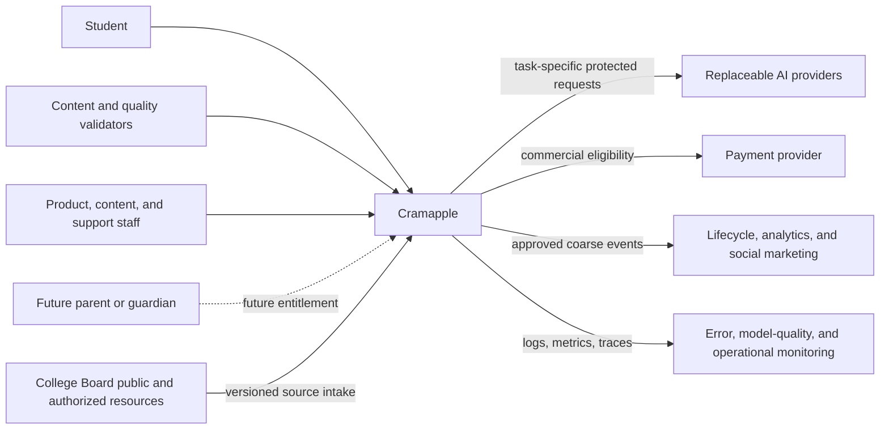
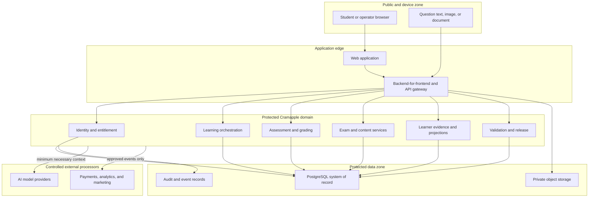

# Cramapple System Context and Logical Component Architecture

**Canonical planning draft | June 10, 2026 | v0.1**

## 1. Document Status

This document refines the approved high-level architecture into a system context and logical component model. It defines system boundaries, actors, trust zones, component responsibilities, information flows, and deployment intent. It remains a planning artifact and does not prescribe final APIs, database tables, vendors, or implementation code.

The companion `TEACHING_AND_PEDAGOGY_DESIGN.md` defines the learning behavior that these components must support. A separate grading design will define scoring and calibration behavior in equivalent detail.

## 2. Architecture Goals

The logical design must:

1. Preserve high teaching and grading quality.
2. Make official exam facts versioned, attributable, and replaceable by exam year.
3. Persist learner evidence across sessions and devices.
4. Separate durable observations from derived mastery, progress, and recommendations.
5. Support additional AP exams through exam packs rather than subject-specific platform forks.
6. Favor managed and low-code infrastructure without placing authoritative logic in the client.
7. Give validators efficient, least-privilege review and release workflows.
8. Keep protected learning data out of marketing and social-media systems.
9. Allow AI providers to change without changing domain contracts.
10. Support planning, validation, and audit before implementation begins.

## 3. Scope

### 3.1 In Scope

- System context and external dependencies.
- User and operator surfaces.
- Logical components and their ownership.
- Trust boundaries and data movement.
- Synchronous and asynchronous interaction patterns.
- Exam specification, content, teaching, grading, learner, and validation boundaries.
- User-provided-question handling.
- Progress, parent entitlement, marketing, and observability boundaries.
- Proposed mapping to Lovable, Vercel, and Supabase.
- Component-level MVP and deferred boundaries.

### 3.2 Out of Scope

- Detailed pedagogy and instructional policy.
- Detailed grading algorithms and prompts.
- Physical database design and row-level-security policies.
- Endpoint-level API specifications.
- Final event schemas.
- Final vendor and model selection.
- Screen-level UX.
- Production deployment.

## 4. System Context



### 4.1 Context Boundary

Cramapple owns the user experience, learner record, exam specifications, approved content, orchestration, recommendations, progress calculations, entitlements, and audit history. External systems may perform narrowly scoped functions, but none is the authoritative owner of protected learner state or instructional policy.

### 4.2 External-System Rules

| External System | Permitted Exchange | Prohibited Exchange |
| --- | --- | --- |
| College Board resources | Public exam specifications and other material used by authorized humans for exam alignment where legally permitted | Unlicensed republication, credential sharing, secure-material disclosure, generative-model input, or using official questions as authoring seeds or adaptation targets |
| AI provider | Minimum task context required for classification, teaching, or grading | Direct database access, unrestricted learner history, marketing identifiers, or authority to publish content |
| Payment provider | Customer, product, payment, subscription, and refund state | Student answers, weaknesses, grades, uploaded questions, or progress narratives |
| Marketing and social platforms | Consent status, campaign attribution, lifecycle stage, and approved conversion events | Detailed learning evidence, grades, rubric results, misconceptions, uploads, or parent reports |
| Observability provider | Redacted operational logs, metrics, traces, and model-quality signals | Raw protected content unless explicitly approved and access-controlled |

## 5. Actors and Surfaces

| Actor | Surface | Primary Capabilities |
| --- | --- | --- |
| Student | Student learning application | Sign up, select exam, diagnose, learn, practice, submit, resume, and view progress |
| Teaching validator | Validator workbench | Review instructional accuracy, pedagogy, hints, explanations, and remediation behavior |
| Grading validator | Validator workbench | Independently score responses and compare criterion-level decisions |
| Lead validator | Validator workbench | Resolve disagreement, calibrate reviewers, approve exceptions, and recommend release |
| Content author | Content workbench | Create and revise questions, exam metadata, lessons, hints, misconceptions, and rubric packages |
| Release approver | Release console | Publish only versions that meet required gates |
| Product administrator | Administration console | Configure exams, versions, entitlements, assignments, and operational policies |
| Support operator | Support console | Resolve account issues with masked or scoped learning-data access |
| Parent or guardian | Future parent portal | View an approved aggregate progress summary after relationship, consent, entitlement, and visibility checks |

## 6. Trust Zones



### 6.1 Enforcement Principles

- The browser is untrusted and never calculates authoritative mastery, grades, entitlements, or recommendations.
- Authentication establishes identity; authorization is checked independently for every protected action.
- Database row-level security provides defense in depth, not the only authorization layer.
- Private uploads use short-lived access and are scanned before processing.
- Model and integration credentials remain server-side.
- Validator access is scoped by role, exam, artifact type, assignment, and version.
- Parent payment does not grant learner-data access by itself.

## 7. Logical Component Architecture

```mermaid
flowchart TB
    subgraph Experience["Experience layer"]
        StudentApp["Student application"]
        ValidatorUI["Validator workbench"]
        AdminUI["Administration and support console"]
        ParentUI["Future parent portal"]
    end

    subgraph Access["Access and application layer"]
        Gateway["API gateway / backend-for-frontend"]
        Auth["Identity, session, consent, and entitlement service"]
        Uploads["Upload intake and document processing"]
    end

    subgraph LearningDomain["Learning domain"]
        Session["Learning session orchestrator"]
        Diagnostic["Diagnostic engine"]
        Teaching["Teaching engine"]
        NextAction["Next-best-action engine"]
        Scheduler["Retrieval and review scheduler"]
        Progress["Progress and motivation service"]
        QuestionIntake["User-provided-question service"]
    end

    subgraph AssessmentDomain["Assessment domain"]
        Submission["Submission service"]
        Grading["Grading orchestrator"]
        Evaluation["Criterion evaluation adapters"]
        Boundary["Criterion boundary calibration"]
        Escalation["Confidence and human-escalation service"]
    end

    subgraph KnowledgeDomain["Exam and knowledge domain"]
        ExamSpec["Exam Specification Registry"]
        ContentRepo["Canonical content repository"]
        RubricRepo["Rubric and scoring package repository"]
        SourceRepo["Source and provenance registry"]
        ExamPack["Exam pack resolver"]
    end

    subgraph LearnerDomain["Learner domain"]
        Evidence["Learner evidence service"]
        Projection["Learner model projector"]
        Calibration["Metacognitive calibration service"]
        RecommendationState["Recommendation state store"]
    end

    subgraph QualityDomain["Quality and release domain"]
        Authoring["Authoring and versioning service"]
        Review["Review assignment and comparison"]
        Release["Release and revalidation service"]
        Quality["Quality monitoring and evaluation"]
    end

    subgraph Platform["Platform and integration services"]
        Events["Transactional outbox and event routing"]
        Notifications["Notification service"]
        Integrations["Marketing, analytics, and payment adapters"]
        Audit["Audit and provenance service"]
        Observability["Operational and model observability"]
    end

    StudentApp --> Gateway
    ValidatorUI --> Gateway
    AdminUI --> Gateway
    ParentUI --> Gateway
    Gateway --> Auth
    Gateway --> Uploads
    Gateway --> Session
    Gateway --> Submission
    Gateway --> Progress
    Gateway --> QuestionIntake

    Session --> Diagnostic
    Session --> Teaching
    Session --> NextAction
    NextAction --> Scheduler
    Session --> ExamPack
    QuestionIntake --> Uploads
    QuestionIntake --> Teaching
    QuestionIntake --> Grading

    Submission --> Grading
    Grading --> Evaluation
    Grading --> Boundary
    Grading --> Escalation
    Grading --> RubricRepo
    Boundary --> RubricRepo
    Boundary --> Review

    ExamPack --> ExamSpec
    ExamPack --> ContentRepo
    ExamPack --> RubricRepo
    ExamSpec --> SourceRepo
    ContentRepo --> SourceRepo
    RubricRepo --> SourceRepo

    Diagnostic --> Evidence
    Teaching --> Evidence
    Grading --> Evidence
    Evidence --> Projection
    Evidence --> Calibration
    Projection --> NextAction
    Calibration --> NextAction
    Scheduler --> NextAction
    NextAction --> RecommendationState
    Progress --> Evidence
    Progress --> Projection
    Progress --> Calibration

    Authoring --> ExamSpec
    Authoring --> ContentRepo
    Authoring --> RubricRepo
    Review --> Authoring
    Release --> Review
    Release --> ExamPack
    Quality --> Release

    LearningDomain --> Events
    AssessmentDomain --> Events
    LearnerDomain --> Events
    QualityDomain --> Events
    Events --> Notifications
    Events --> Integrations
    Platform --> Audit
    Platform --> Observability
```



## 8. Component Responsibilities

### 8.1 Experience Layer

#### Student Application

- Presents onboarding, diagnostics, lessons, practice, grading feedback, recommendations, and progress.
- Captures responses, work, confidence, time, help usage, and learner choices.
- Explains desirable difficulty and recommendation reasoning.
- Displays authoritative server results without recreating domain calculations.

#### Validator Workbench

- Presents assigned artifacts and evaluation cases.
- Supports blind independent review when required.
- Compares validator and model decisions at criterion level.
- Records dispositions, comments, confidence, conflicts, and release recommendations.

#### Administration and Support Console

- Configures exams, versions, availability, assignments, and operational policies.
- Separates product administration from sensitive learner support.
- Uses masked data and time-limited elevation for exceptional support access.

#### Future Parent Portal

- Shows only approved aggregate progress fields.
- Requires verified relationship, learner/guardian consent rules, active entitlement, and field-level visibility.
- Does not expose raw answers, uploads, tutor notes, or detailed misconceptions by default.

### 8.2 Access and Application Layer

#### API Gateway / Backend-for-Frontend

- Terminates application requests and applies rate, schema, and authorization checks.
- Produces client-specific response shapes.
- Coordinates domain calls but does not own teaching, grading, or mastery rules.
- Issues idempotency keys for retried writes.

#### Identity, Session, Consent, and Entitlement Service

- Owns account identity, login sessions, age/consent state, roles, exam enrollments, and commercial eligibility.
- Evaluates entitlements independently from UI state.
- Represents validator scope and future parent access explicitly.

#### Upload Intake and Document Processing

- Accepts text, image, screenshot, and document inputs.
- Performs file-type validation, malware scanning, size limits, OCR/extraction, and privacy checks.
- Retains original and extracted artifacts according to approved policies.

### 8.3 Learning Domain

#### Learning Session Orchestrator

- Creates, resumes, and completes learning sessions.
- Executes the unified pedagogical state machine, including cold, coached, exam-simulation, escalation, Move On, Park, and return states.
- Coordinates attempt, diagnosis, teaching, retry, grading, and scheduling.
- Records which policy and content versions governed each interaction.

#### Diagnostic Engine

- Selects discriminating initial and follow-up tasks.
- Classifies observed errors across content, practice, task, misconception, prerequisite, expression, and confidence dimensions.
- Distinguishes evidence from inference and attaches uncertainty.

#### Teaching Engine

- Selects approved intervention patterns.
- Produces hints, explanations, examples, comparisons, and retry prompts from versioned teaching artifacts.
- Enforces support ladders and avoids revealing complete answers too early.
- Returns structured teaching outcomes rather than free-form text alone.

#### Next-Best-Action Engine

- Ranks eligible actions using exam opportunity, learner deficit, estimated improvability, retention, transfer, time cost, prerequisites, and days remaining.
- Explains the evidence and assumptions behind each recommendation.
- Applies policy constraints such as overdue retrieval, format balance, fatigue, and content coverage.

#### Retrieval and Review Scheduler

- Creates same-session and delayed retrieval obligations.
- Adjusts spacing to exam date, prior success, assistance, confidence, and available days.
- Prevents new-content recommendations from crowding out due retrieval.

#### Progress and Motivation Service

- Separates effort measures from learning evidence.
- Produces qualified improvement statements based on comparable attempts.
- Shows confidence calibration and explains recommended next actions.
- Avoids unsupported mastery, score, or causal claims.

#### User-Provided-Question Service

- Classifies outside questions and requested modes: teach, hint, solve, or check work.
- Links questions to canonical concepts and skills without adding them to the approved library.
- Detects insufficient context and requests clarification.
- Applies stronger uncertainty and provenance disclosures than canonical content.
- Separates private learner use, anonymous internal improvement use, and separately gated public publication.
- Hands approved public-page candidates to the marketing/content publication workflow; publication does not change private learner evidence, grading, or access.
- Before public publication, sweeps for the signed-in user's proper name variants and holds or removes matches.

### 8.4 Assessment Domain

#### Submission Service

- Owns immutable student submissions and revisions.
- Stores response modality, question version, timing, assistance, and submission context.
- Distinguishes abandoned drafts from completed attempts.

#### Grading Orchestrator

- Selects the applicable grading package and evaluation workflow.
- Combines deterministic checks, model-supported evaluation, and human review.
- Applies approved criterion-boundary contracts before presenting earned or
  missed decisions.
- Returns criterion-level evidence, decision gates, estimated scoring,
  feedback, and confidence.

#### Criterion Evaluation Adapters

- Hide provider-specific model calls behind typed task contracts.
- Route provider calls through Vercel AI Gateway by default. The
  `provider/model` identifier (e.g., `openai/gpt-5.5`,
  `anthropic/claude-haiku-4-5`, `google/gemini-2.5-flash`) abstracts the
  upstream provider, so an arm can change models without changing
  adapter code. Direct-provider calls remain a permitted fallback if the
  gateway has a regional outage.
- Validate structured outputs and retry only within policy.
- Preserve prompt, model, parameter, gateway routing decision, and
  source versions for audit.

#### Criterion Boundary Calibration

- Owns the operational scoring-threshold contract for each grading-sensitive
  criterion.
- Stores required evidence targets, accepted boundary examples, insufficient
  boundary examples, contradiction rules, ambiguity rules, minimum fixes, and
  adjudicated case IDs.
- Requires evidence extraction before a model-supported point can be awarded.
- Validates gate/status invariants, such as "empty evidence quote cannot earn"
  and "failed gate cannot earn."
- Distinguishes model defects from rubric-boundary or label-quality defects.
- Routes apparent boundary conflicts to Learning Quality before using those
  labels as grader ground truth.
- Records boundary-contract version IDs with every grading result for audit and
  revalidation.

#### Confidence and Human-Escalation Service

- Converts evaluation signals into calibrated confidence bands.
- Routes ambiguous, novel, high-impact, or disagreement cases to validators.
- Prevents low-confidence scoring from being presented as authoritative.

### 8.5 Exam and Knowledge Domain

#### Exam Specification Registry

The registry is the authoritative store for exam facts that guide prioritization. Each fact must include:

- Exam and school-year version.
- Effective and expiration dates.
- Official source and source type.
- Source publication or update date when available.
- Retrieval date.
- Exact scope, such as "multiple-choice section" rather than "whole exam."
- Value, range, unit, and any conditions.
- Validator and approval state.
- Supersession relationship.

Examples include section weights, question counts, timing, raw-point distributions, unit ranges, science-practice ranges, FRQ archetypes, part-level points, task definitions, calculator rules, and exam-delivery mode.

Official facts and Cramapple-derived planning values are separate record types. A derived value must identify its formula, inputs, assumptions, model version, and approval.

#### Canonical Content Repository

- Owns approved questions, stimuli, lessons, hints, examples, misconception interventions, and transfer variants.
- Tags artifacts to exam, unit, topic, learning objective, practice, skill, task verb, question type, and difficulty.
- Keeps public, licensed, authored, and restricted materials distinguishable.

#### Rubric and Scoring Package Repository

- Owns question-specific and archetype-level grading criteria.
- Stores scoring guidance, accepted alternatives, insufficient or common
  non-credit responses, samples, calibration cases, and criterion-boundary
  contracts.
- Versions boundary contracts with the rubric so scoring-threshold changes
  trigger revalidation rather than silently changing model behavior.
- Is consumed by grading but may also expose approved criterion descriptions to teaching.

#### Source and Provenance Registry

- Records where every exam fact and content artifact came from.
- Tracks legal/use status, access restrictions, checksum, publication year, and review history.
- Supports source replacement and impact analysis.

#### Exam Pack Resolver

- Assembles the active, approved versions of exam specification, taxonomy, content, teaching policy extensions, rubrics, and validator qualifications.
- Prevents partially approved versions from becoming active.
- Allows multiple school-year versions to coexist for audit and migration.

### 8.6 Learner Domain

#### Learner Evidence Service

- Stores append-oriented observations: attempts, answers, scores, criterion outcomes, confidence, time, hints, interventions, retries, and delayed reviews.
- Treats evidence as durable and attributable.
- Does not overwrite history when interpretations change.
- Records skill-and-task state, support level, escalation route, Park timing, and immediate versus delayed outcomes.
- Records assessable skill target, representation facet, Frame type, recommendation, learner override, and attempt evidence conditions.

#### Learner Model Projector

- Converts evidence into rebuildable estimates by content, practice, task, question form, misconception, and prerequisite.
- Represents uncertainty, recency, assistance, and transfer distance.
- Produces current deficits and readiness estimates for recommendations.

#### Metacognitive Calibration Service

- Compares confidence with correctness and independence.
- Detects recurring overconfidence and underconfidence.
- Supplies student-facing calibration feedback and recommendation features.

#### Recommendation State Store

- Stores generated recommendations, explanations, eligibility reasons, acceptance, deferral, completion, and outcome.
- Supports analysis of whether recommendations improved later performance.

#### Improvement Dataset Builder

- Creates governed anonymous or deidentified datasets from student responses, outcomes, and validator corrections.
- Excludes identity, account, payment, parent, and direct-contact fields.
- Keeps source version, model version, adjudication status, assessable skill target and facet, intervention, and outcome provenance.
- Supplies evaluation, grading, teaching, content, prompt, model-configuration, and routing-improvement workflows.
- Does not publish learner material; public publication is a separate release workflow.

#### Public Educational Content Publisher

- Is owned primarily by the marketing/content domain.
- Accepts only candidates that pass source, rights, identity, scientific, teaching, and grading gates.
- Packages approved questions, explanations, and optional transfer activities for SEO, AEO, social, and lifecycle distribution.
- Measures acquisition and engagement without feeding publication status into the originating learner's grade or proficiency model.
- Preserves version and validator provenance for every educational claim displayed publicly.

### 8.7 Quality and Release Domain

#### Authoring and Versioning Service

- Creates immutable versions of exam facts, content, rubrics, policies, and model configurations.
- Supports drafts, comparison, replacement, and deprecation.

#### Review Assignment and Comparison

- Assigns work by qualification, exam, artifact type, and conflict rules.
- Supports independent review and structured comparison.
- Measures validator agreement and reviewer calibration.

#### Release and Revalidation Service

- Enforces required teaching, grading, legal, and release approvals.
- Publishes complete exam packs atomically.
- Reopens impacted artifacts after source, policy, prompt, or model changes.

#### Quality Monitoring and Evaluation

- Runs curated evaluation sets and production sampling.
- Tracks teaching defects, grading disagreement, model drift, recommendation outcomes, and student reports.
- Creates incidents and revalidation work when thresholds are crossed.

### 8.8 Platform and Integration Services

#### Transactional Outbox and Event Routing

- Persists domain events with the same transaction as authoritative state changes.
- Delivers events asynchronously with retries, deduplication, and dead-letter handling.
- Prevents marketing or analytics failures from blocking learning.

#### Notification Service

- Sends due-review and lifecycle communications under consent and frequency policies.
- Receives learning-safe event payloads rather than direct learner-table access.

#### Integration Adapters

- Translate internal events into payment, analytics, marketing, and social-platform contracts.
- Apply field allowlists, consent, hashing, and destination-specific policy.

#### Audit and Provenance Service

- Records protected reads, writes, releases, overrides, model calls, source versions, and administrator actions.
- Supports incident review and reconstruction of student-visible outcomes.

#### Operational and Model Observability

- Tracks availability, latency, errors, queues, cost, token use, structured-output failures, confidence distributions, and drift.
- Redacts protected content by default.

## 9. Core Information Flows

### 9.1 Sign Up and Start Learning

```text
Student application
  -> identity and consent
  -> learner profile and exam enrollment
  -> active exam pack resolution
  -> optional diagnostic or chosen topic
  -> learning session orchestration
  -> learner evidence
  -> learner model projection
  -> next recommendation
```

### 9.2 Resume Learning

```text
Restore identity and active enrollment
  -> load incomplete session and due retrieval
  -> load current learner projections
  -> generate eligible actions
  -> explain highest-ranked action
  -> resume or choose another action
  -> append new evidence
```

### 9.3 Diagnose, Teach, Retry, and Schedule

```text
Cold attempt plus confidence
  -> grade or evaluate
  -> diagnostic classification
  -> minimal approved intervention
  -> transfer attempt
  -> evidence append
  -> projection update
  -> delayed review schedule
```

### 9.4 Grade an FRQ

```text
Immutable submission
  -> resolve question and rubric package
  -> deterministic and model-supported criterion evaluation
  -> confidence calculation
  -> optional human escalation
  -> estimated scoring and criterion feedback
  -> learner evidence
  -> teaching and recommendation update
```

### 9.5 Validate and Release

```text
Draft version
  -> source and policy checks
  -> assigned teaching and/or grading review
  -> independent decisions
  -> disagreement resolution
  -> release approval
  -> atomic exam-pack publication
  -> production monitoring and revalidation triggers
```

### 9.6 User-Provided Question

```text
Text or upload intake
  -> scan and extraction
  -> classify exam, content, practice, task, and archetype
  -> estimate confidence and missing context
  -> select teach, hint, solve, or grade workflow
  -> ground in approved exam pack
  -> disclose limitations
  -> store as private learner evidence
  -> create anonymous improvement evidence under policy
  -> hand candidate to marketing/content workflow
  -> publish only through separate quality, rights, identity, and pedagogical gates
```

## 10. Data Ownership

| Data Class | Authoritative Owner | Derived Consumers |
| --- | --- | --- |
| Identity, consent, roles, entitlements | Identity and entitlement service | All authorized surfaces |
| Official exam facts | Exam Specification Registry | Teaching, grading, recommendations, progress |
| Source and legal provenance | Source and provenance registry | Authoring, release, audit |
| Approved teaching content | Canonical content repository | Teaching and recommendation engines |
| Rubrics and grading packages | Rubric repository | Grading and teaching |
| Student submissions | Submission service | Grading, evidence, progress |
| Learner observations | Learner evidence service | Projection, calibration, recommendations |
| Anonymous improvement examples | Improvement dataset builder | Evaluation, teaching, grading, content, and model-policy improvement |
| Mastery/readiness estimates | Learner model projector | Recommendations and progress |
| Recommendation decisions | Next-best-action engine | Student application and analytics |
| Review and release state | Quality and release domain | Exam pack resolver |
| Marketing events | Event routing and adapters | Approved external destinations |

## 11. Interaction Patterns

### 11.1 Synchronous

Use synchronous requests when the learner is waiting for:

- Session creation or resume.
- Question retrieval.
- Hint or explanation.
- MCQ feedback.
- Short grading result when latency is acceptable.
- Recommendation explanation.
- Entitlement or authorization decision.

### 11.2 Asynchronous

Use asynchronous work for:

- OCR and complex upload processing.
- Long-form or multi-pass grading.
- Human escalation.
- Learner projection rebuilds.
- Delayed-review scheduling.
- Evaluation suites and production sampling.
- Marketing and analytics delivery.
- Notifications.
- Revalidation and release impact analysis.

### 11.3 Reliability Rules

- Every write endpoint is idempotent.
- Long-running jobs expose status and recover after retry.
- Events are delivered at least once and consumers deduplicate.
- Student-visible state changes do not depend on successful marketing delivery.
- Recommendation generation degrades to approved deterministic choices if model services fail.
- Learner evidence is committed before derived projections.

## 12. AI Provider Boundary

AI providers are execution dependencies, not domain owners.

Model calls are issued through **Vercel AI Gateway** as the standard
intermediary. The gateway provides one authenticated egress for OpenAI,
Anthropic, Google, and any future provider Cramapple adopts; short-lived
OIDC tokens replace per-provider API keys in the runtime; billing,
observability, prompt caching, BYOK routing, and failover are configured
centrally rather than in app code. Direct-provider calls remain a
permitted operational fallback during a gateway outage but are not the
default code path. The gateway feature-verification gate and overhead
calibration are documented in
`docs/research/sp1_gateway_verification.md`.

Each model task must define:

- Typed input and output schema.
- Allowed data classes.
- Active prompt and policy version.
- Required grounding sources.
- Deterministic validation rules.
- Confidence and escalation behavior.
- Timeout, retry, and fallback policy.
- Evaluation suite and release threshold.
- Logging and retention policy.
- Routing decision (gateway vs direct) and the cached-prefix strategy
  for the prompt.

Model tasks may include classification, misconception detection, teaching-expression generation, answer extraction, and criterion evaluation. Final recommendations, releases, entitlements, and official-fact changes remain controlled by Cramapple policy.

## 13. Proposed Managed-Service Mapping

| Logical Responsibility | Proposed Managed Placement |
| --- | --- |
| Student and internal interfaces | Lovable-generated or maintained frontend deployed through Vercel |
| Backend-for-frontend and domain orchestration | Vercel server functions or equivalent managed application runtime |
| Authentication | Supabase Auth |
| System-of-record data | Supabase PostgreSQL |
| Row-level security | Supabase PostgreSQL RLS |
| Private uploads | Supabase Storage with signed access |
| Scheduled review work | Managed cron invoking protected server jobs |
| Event outbox | PostgreSQL outbox tables and managed workers |
| AI calls | Server-side adapters routed through Vercel AI Gateway using a Vercel-issued OIDC token; direct-provider fallback retained for gateway outages |
| Product analytics and marketing | Destination adapters receiving approved events |

This is a proposed mapping, not a commitment. Component contracts should survive replacement of any listed vendor.

## 14. MVP Component Boundary

### 14.1 Required for MVP

- Student application.
- API gateway/backend-for-frontend.
- Identity, consent, and student entitlement.
- Exam Specification Registry for AP Biology.
- Canonical content and rubric repositories.
- Exam pack resolver.
- Learning session orchestrator.
- Diagnostic, teaching, recommendation, and review-scheduling capabilities at a useful minimum.
- Submission and estimated-grading workflow.
- Learner evidence and projection.
- Basic progress display.
- Validator workbench, assignments, release gates, and audit.
- Operational monitoring.
- Approved product and marketing events.

### 14.2 Account For, Stage as Feasible

- Image and document question intake.
- Sophisticated empirical improvability models.
- Multiple AI providers per task.
- Rich production sampling and drift automation.
- Advanced content-authoring tools.

### 14.3 Deferred

- Parent portal and paid parent entitlement.
- School and teacher dashboards.
- Peer or collaborative learning.
- Fully automated publication.
- Cross-exam learner models.

## 15. Architecture Decisions Established Here

1. Official exam facts have a dedicated versioned registry.
2. Official facts and Cramapple-derived planning values are different record types.
3. Learning orchestration, teaching, grading, and learner projection are separate logical responsibilities.
4. Learner evidence is durable; mastery and recommendations are rebuildable.
5. Exam packs bind complete approved versions atomically.
6. Validator and release operations are production components.
7. User-provided questions remain noncanonical; private learner use, anonymous internal improvement use, and public publication are separate governed states.
8. External marketing systems receive allowlisted events, not learning records.
9. Managed vendors implement contracts but do not define them.
10. Model calls route through Vercel AI Gateway by default. The
    `provider/model` identifier is the unit of model selection; per-provider
    keys do not appear in the production runtime; the verification of this
    decision lives in `docs/research/sp1_gateway_verification.md`.

## 16. Open Design Questions

- Which learner and validator actions require real-time versus queued grading?
- Which exam-specification changes require full exam-pack revalidation?
- How much raw response text may be retained, and for how long?
- Which user-provided-question formats are safe and feasible for MVP?
- What model-provider data-retention terms are acceptable for minors?
- What deterministic fallback recommendation set is required during provider failure?
- What validator agreement thresholds gate teaching and grading releases?
- What are the exact boundaries between progress reporting and estimated score projection?

## 17. Required Follow-On Designs

1. Teaching and Pedagogy Design.
2. Grading and Calibration Design.
3. Shared Data and Event Contract Design.
4. Security, Privacy, and Minor-Consent Design.
5. Validator Workbench and Release Workflow Design.
6. Marketing and Lifecycle Integration Design.
