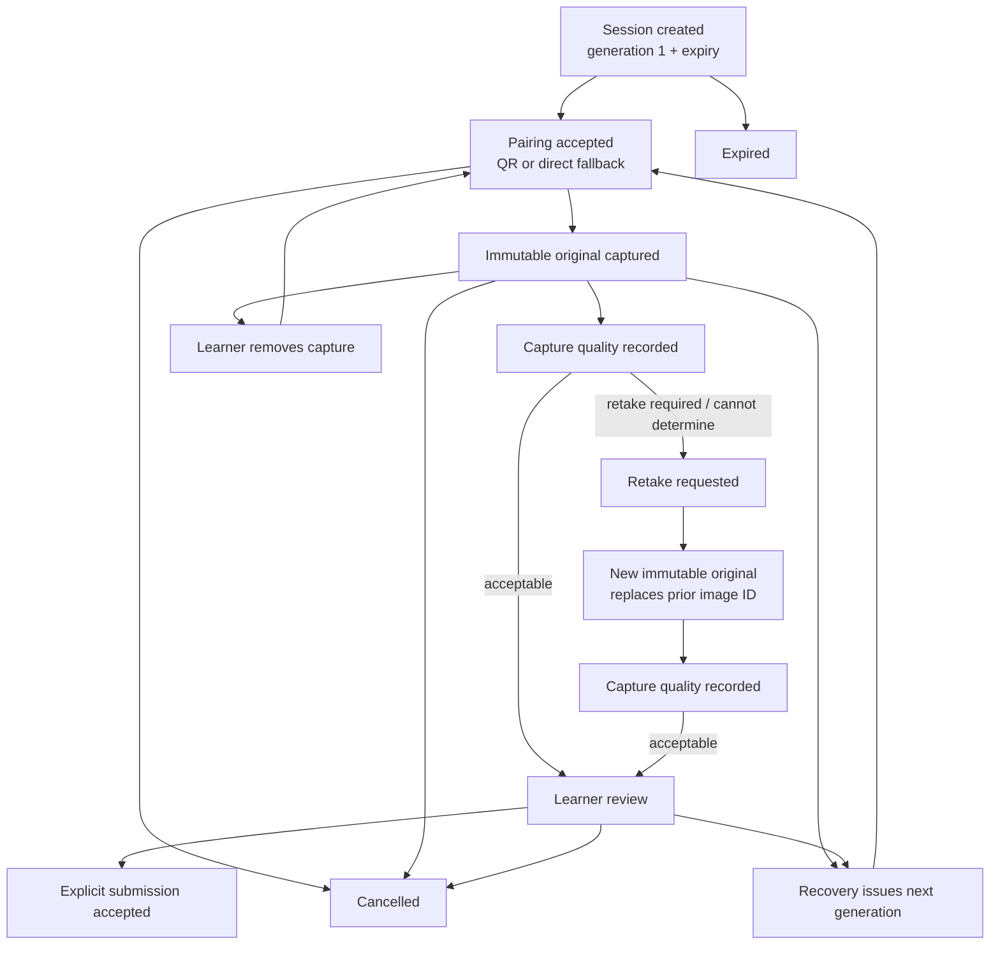

# Hand-Drawn Capture Session Contract

**Status:** Offline logical contract; no participant-facing prototype or
Production implementation approved
**Date:** 2026-08-03
**Related:** `TASK-0011`, `TASK-0016` Phase D

## Outcome

Cramapple now has an executable, fail-closed contract for the response journey
between creating a short-lived submission slot and accepting one immutable
hand-drawn response image. It complements the capture-image provenance schema;
it does not select a database, QR/token implementation, storage provider, or
frontend.

The contract is append-only. Every event repeats the same immutable binding:

- opaque learner subject reference;
- learning session;
- exact content-item version and stable item ID;
- response and submission slot;
- terminal capture-session lease expiry; and
- the single `DRAWN_RESPONSE` upload purpose.

Pairing records contain only a lowercase SHA-256 handle digest. Raw QR or
fallback secrets are forbidden from the audit stream.

## State and evidence flow



Rejected pairing and submission attempts are audit events that do not mutate
the active state. A used or superseded handle, expired handle, duplicate
submission, submission without an active image, unacceptable quality, or
missing learner review must fail closed.

## Enforced invariants

`capture_session_event.schema.json` plus `validate_records.py` enforce:

1. Positive contiguous sequences in physical append order, unique event IDs,
   nondecreasing timestamps, one unchanged binding per session, and one capture
   session per submission slot.
2. Positive pairing generations, exact issued hash/expiry reuse, one accepted
   use per generation, noninclusive expiry, generation-by-generation recovery,
   no handle-hash reuse across sessions, and no pairing that outlives the
   distinct capture-session lease.
3. Capture only after current pairing acceptance; each new original has a new
   image ID and an explicit `replaces_image_id` when it is a retake.
4. Quality and review events target the current image. System/staff retake
   requests require a blocking quality state.
5. Submission requires the current image, `ACCEPTABLE` capture quality,
   learner review, and explicit confirmation.
6. Submission, cancellation, and expiry are terminal. Only rejected replay or
   duplicate/terminal submission audit events may follow.
7. Every captured image resolves to an `ORIGINAL` capture-image record with the
   same response, item, and exact content-item version; verified provenance;
   eligible consent; and an ingestion timestamp no later than the capture
   event.
8. A capture-image original cannot be bound to two capture sessions.

Capture quality remains separate from correctness. `ACCEPTABLE` means the
photograph is usable; it does not say the learner's graph satisfies a rubric.

## Fixture coverage

The synthetic valid stream contains 27 events across four sessions:

- QR pairing, replay rejection, blurred first capture, retake, acceptable
  second capture, learner review, disconnected-device recovery, direct
  fallback, explicit submission, and duplicate-submission rejection;
- direct-fallback pairing followed by learner cancellation and terminal replay
  rejection;
- expired-handle rejection followed by session expiry; and
- learner review, removal, blocked no-image submission, and cancellation.

The negative stream attempts submission immediately after capture and is
rejected for missing acceptable quality and a terminal outcome. A separate
drift check proves that mismatching only the content-item version in the image
records is rejected. Ten stdlib regression tests additionally cover raw-
secret rejection, physical append order, noninclusive expiry, pending consent,
invalid calendar dates, duplicate slot binding, and explicit validation of a
still-open session stream.

Run:

```bash
python3 scripts/drawn_response/validate_records.py \
  capture_session_event \
  scripts/drawn_response/fixtures/capture_session_events.valid.jsonl \
  --capture-images \
  scripts/drawn_response/fixtures/capture_session_images.valid.jsonl
python3 scripts/drawn_response/test_capture_session_contract.py
```

Complete exported sessions require a terminal event by default. Operational
inspection of a still-active stream must opt in with `--allow-open-sessions`;
all other transition and linkage checks remain active.

## Remaining gates

This contract is implementation input, not evidence that the capture
experience works. The staff-only QR/direct-upload prototype, real token and
authorization design, upload threat testing, representative devices,
retention/deletion behavior, assistive-technology testing, privacy/security
review, and participant use remain approval-gated.
