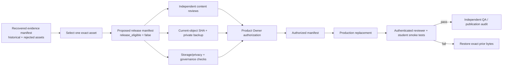

# Question-Image Release Candidate Workflow

**Status:** Proposed local release envelope; not authorized or release eligible
**Date:** 2026-08-03
**Current candidate:** `APBIO-FRQ-S-009` v3

## Outcome

Question-image recovery evidence and Production release authorization are now
separate artifacts. The recovered package contains historical, retired, and
rejected assets and must never become releasable as a unit. The new release
workflow extracts exactly one non-rejected asset into a self-resolving proposed
manifest while preserving its original checksum, exact item version, review
packet, deterministic source, and source-package relationship.

The generated S009 v3 release manifest targets:

- Production project `pcntajvbdfqhbeewmdry`;
- bucket `content-assets`;
- object and database path `Biology/FRQ/APBIO-FRQ-S-009.png`;
- published content version
  `de59d53c-1f80-4b1a-9694-10d9e50dcad0`; and
- proposed bytes SHA-256
  `85c146a2fcf494656635fa32acc7a4d4a050ec6566e71942adcc2f174d1361ea`
  (49,271 bytes, 1,192 × 774 px).

No Production object, database row, release-candidate row, or approval record
was changed.

## Release path



This repository implements the path through a proposed manifest. The
authorization, Production mutation, smoke tests, and rollback execution remain
Hard Gates.

## Machine-enforced conditions

`scripts/prepare_image_release_candidate.py` and
`scripts/validate_image_package.py` enforce:

1. The source recovery manifest is structurally valid.
2. Exactly one published asset is selected, and rejected review, rights, or
   answer-leakage state cannot be extracted.
3. The source package ID, asset checksum, content version, file, and review
   packet remain self-resolving and drift-free.
4. The release configuration and generated manifest remain byte-for-byte
   aligned on target, current object, operational gates, rollback, and
   execution state.
5. The Storage object path is relative, URL-free, and equal to the database
   `stimulus_image_path` value.
6. Proposed-object checksum, byte length, and dimensions match the actual PNG.
7. A verified current-object identity requires its exact SHA-256. A verified
   rollback backup requires a private, non-URL artifact reference.
8. Approved review gates require reviewer and timestamp attribution. Closed
   operational gates require non-empty evidence.
9. Release eligibility requires approved human content/rights/accessibility
   state, an eligible review packet and render matrix, every operational gate
   closed, approved rollback, and `execution_status: authorized`.

Nine stdlib regression tests prove valid single-asset extraction, deterministic
output, source-drift rejection, refusal of rejected v2, unsafe-path rejection,
post-generation configuration-drift detection, fail-closed release status, and
refusal of unattributed review approval or unevidenced operational approval.

## Current blockers

The proposed manifest records one read-only-verified database binding. It keeps
the following open:

- exact SHA-256 of the current 48,400-byte Production object;
- private rollback backup and restore reference;
- scientific, grading, accessibility, visual-layout, and rights approval;
- browser 200%, print, and assistive-technology review;
- Storage-policy review and governance registration;
- explicit Product Owner approval;
- authenticated reviewer and student delivery;
- independent QA and rollback readiness.

The current object must be exported to approved private storage before
replacement. Neither its bytes nor a public/signed URL belongs in git.

## Commands

```bash
python3 scripts/prepare_image_release_candidate.py \
  docs/research/ap_biology_stimulus_images_2026_07_12/manifest.json \
  docs/research/ap_biology_stimulus_images_2026_07_12/release_candidates/APBIO-FRQ-S-009-v3-release-config.json \
  docs/research/ap_biology_stimulus_images_2026_07_12/APBIO-FRQ-S-009-v3-release-manifest.json

python3 scripts/validate_image_package.py \
  docs/research/ap_biology_stimulus_images_2026_07_12/APBIO-FRQ-S-009-v3-release-manifest.json

python3 scripts/test_image_release_candidate.py
```

`--require-release-eligible` intentionally fails until every recorded gate is
approved and the authorized manifest is independently reviewed.
