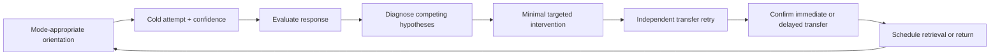

# Cramapple Teaching and Pedagogy Design

**Canonical planning draft | June 10, 2026 | v0.2**

## 1. Document Status

This document defines the proposed teaching behavior of Cramapple. It translates the ten-day AP-exam preparation constraint into a pedagogical contract, diagnostic model, next-best-action policy, and validation framework.

It is a planning artifact. It does not contain final prompts, algorithms, database schemas, lesson content, or production score claims. Teaching and grading remain separate systems: grading produces structured evidence; teaching decides what the learner should do next.

## 2. Central Reframe

Cramapple is not a conventional year-long course and should not imitate one badly. Its initial use case is a learner with approximately ten days remaining before an AP exam.

The product objective is therefore:

> Improve the learner's ability to retrieve and apply exam-relevant knowledge and skills independently through exam day.

The product does not promise durable long-term mastery from ten days of study. It uses the short window deliberately by prioritizing retrieval, distributed return visits, interleaving, transfer, metacognitive calibration, and exam-value-aware allocation.

## 3. Pedagogical Contract

### 3.1 Required Teaching Behaviors

1. **Elicit an attempt before substantial explanation.**
   The default first move is a question, prediction, interpretation, calculation, or response component. The system captures the answer and confidence before teaching.

2. **Diagnose before remediating.**
   A wrong answer is evidence of failure on one task, not proof of a specific misconception. Follow-up tasks must discriminate among knowledge, prerequisite, reading, representation, calculation, task-language, and expression gaps.

3. **Teach the smallest missing element.**
   Interventions should address the diagnosed gap rather than replaying a full chapter.

4. **Require retrieval after teaching.**
   Explanations are followed by a new attempt. Reading an explanation is not accepted as evidence of learning.

5. **Test transfer, not recognition alone.**
   The immediate retry should use a new but structurally related item when possible.

6. **Return to prior material before the exam.**
   The system schedules delayed retrieval and prevents new material from displacing all due review.

7. **Interleave content and skills deliberately.**
   Learners practice selecting the applicable concept or method, not merely repeating a blocked procedure.

8. **Explain desirable difficulty.**
   The system tells learners that mixed retrieval can feel harder and produce more mistakes during practice even when it improves later discrimination and transfer.

9. **Build metacognitive calibration.**
   Confidence is compared with performance. Recommendations disclose why an action was selected and what evidence would change the recommendation.

10. **Optimize expected exam contribution, not equal curriculum coverage.**
    Exam weight matters, but it is combined with current deficit, teachability, retention, transfer, prerequisites, time cost, and days remaining.

11. **Teach FRQ points criterion by criterion.**
    The system teaches students to satisfy the exact task and scoring opportunity. Claim-evidence-reasoning is a major argumentation structure, not a universal substitute for every AP Biology task.

12. **Represent uncertainty honestly.**
    Diagnosis, improvability, mastery, and projected scores are estimates. The system qualifies them and improves them through evidence.

### 3.2 Exceptions to Attempt First

Attempt-first is a default, not an absolute rule. A brief scaffold may precede an attempt when:

- The learner reports no exposure and cannot parse the task.
- Accessibility needs require orientation.
- The question depends on missing notation or interface instructions.
- The content is sensitive or safety-related.
- Repeated failure indicates the current task is above the learner's prerequisite level.

Even then, the scaffold should be followed promptly by retrieval.

## 4. Learning-Science Foundation

### 4.1 Retrieval Practice

Retrieving information strengthens later access more effectively than additional passive review in many learning contexts. Cramapple therefore treats attempted recall and application as the primary learning event.

Product implications:

- Questions precede substantial explanations by default.
- Every intervention ends with another attempt.
- Progress depends more on independent retrieval than content viewed.
- Repeated exposure without retrieval is not counted as mastery evidence.

### 4.2 Distributed Practice

Learning benefits when retrieval is distributed rather than compressed into one uninterrupted block. The exact optimal interval depends on the retention horizon and material.

Product implications:

- Cramapple schedules return visits within the remaining exam horizon.
- The initial 24-72 hour interval is a product policy to test, not a universal research constant.
- The final schedule depends on days remaining, difficulty, assistance, confidence, prior success, and available study opportunities.

### 4.3 Interleaving

Interleaving can improve the learner's ability to discriminate among problem types and select the correct approach. It can also reduce immediate fluency and make practice feel less successful.

Product implications:

- Mix units, science practices, representations, and question forms after initial acquisition.
- Compare blocked and mixed performance separately.
- Explain why mixed practice feels harder.
- Do not interpret a temporary session-score decline as automatic regression.

### 4.4 Metacognitive Calibration

Learners benefit from more accurate judgments about what they know and can do. Confidence is therefore evidence in its own right, not decoration.

Product implications:

- Capture confidence before feedback.
- Track overconfidence and underconfidence by skill and question form.
- Show recommendation reasoning.
- Ask learners to predict performance periodically.
- Reward accurate calibration and help-seeking, not confidence alone.

### 4.5 Evidence Status

These foundations are supported by broad learning-science literature, but Cramapple-specific choices must be validated experimentally. The product must not claim that one published effect size applies uniformly to AP Biology, all learners, or a ten-day intervention.

## 5. Ten-Day Learning Model

### 5.1 Unified Learning-State Model



The same model governs ordinary learning and stuck-state escalation. Stuck is a state for a skill-and-task key, not a separate teaching system or a learner label.

Three modes preserve the meaning of performance evidence:

| Mode | Answer-bearing support before attempt | Evidence use |
| --- | --- | --- |
| Cold | None beyond mechanics and accessibility | Eligible for proficiency and progress evidence |
| Coached | Hints, criteria, concepts, or partial structure | Measures supported performance; requires a fresh cold retry |
| Exam simulation | Only support allowed by the exam conditions | Measures execution under the configured simulation |

The system distinguishes supported success, immediate independent transfer, and confirmed delayed retention. It does not convert a repaired answer directly into mastery.

### 5.2 Horizon Phases

| Days Remaining | Primary Objective | Typical Balance |
| --- | --- | --- |
| 10-8 | Establish baseline and find high-value gaps | Broad sampling, short interventions, first retrieval obligations |
| 7-5 | Exploit responsive gaps and build transfer | Targeted teaching, interleaved practice, first delayed checks |
| 4-3 | Consolidate exam-relevant performance | Due retrieval, FRQ criteria, mixed sets, timing |
| 2 | Rehearse under realistic conditions | Timed mixed practice, selective repair, confidence calibration |
| 1 | Protect accessible knowledge and execution | Light retrieval, task-language review, exam logistics; avoid broad new coverage |
| Exam day | Execute | No new diagnostic burden; concise reminders only |

This is a starting policy for validator review and product testing. It is not an immutable schedule.

### 5.3 Initial Retrieval Schedule

When ten days remain and evidence supports continued work:

1. Immediate transfer retry after instruction.
2. First delayed retrieval around 24 hours.
3. Second delayed retrieval around 72 hours.
4. Final retrieval around 6-8 days after initial learning when the exam date permits.

The scheduler compresses or omits intervals when fewer days remain. Failed or heavily assisted retrieval returns sooner; independent successful retrieval returns later.

## 6. AP Biology Exam Specification

### 6.1 Source Authority

The current initial specification is based on College Board's AP Biology Course and Exam Description effective fall 2025, the AP Biology exam page for the May 4, 2026 exam, and released exam materials available through AP Central.

Every exam fact used by teaching must be stored in the Exam Specification Registry with source, scope, effective date, retrieval date, validator, and supersession status.

### 6.2 Section and Raw-Point Distribution

| Component | Questions | Raw Points | Time | Official Exam Weight |
| --- | ---: | ---: | ---: | ---: |
| Multiple-choice section | 60 | 60 | 90 minutes | 50% |
| Free-response section | 6 | 34 | 90 minutes | 50% |
| FRQ 1: Experimental results | 1 | 9 | Within FRQ section | Part of FRQ 50% |
| FRQ 2: Experimental results with graphing | 1 | 9 | Within FRQ section | Part of FRQ 50% |
| FRQs 3-6: Short response | 4 | 4 each | Within FRQ section | Part of FRQ 50% |

### 6.3 Cramapple Planning Values

The following are derived planning approximations, not College Board score-conversion statements:

| Raw Opportunity | Approximate Share of Weighted Exam |
| --- | ---: |
| One MCQ | 50 / 60 = 0.83 percentage point |
| One FRQ rubric point | 50 / 34 = 1.47 percentage points |
| One 9-point long FRQ | 13.24 percentage points |
| Both long FRQs | 26.47 percentage points |
| One 4-point short FRQ | 5.88 percentage points |
| All four short FRQs | 23.53 percentage points |

These values are useful for relative practice allocation only. College Board combines weighted section results and converts the composite to an AP score. Cramapple must not imply that stable raw-score cutoffs or a precise linear 1-5 conversion are official or guaranteed.

### 6.4 Multiple-Choice Unit Distribution

These ranges apply specifically to the multiple-choice section:

| Unit | Official MCQ Weight Range |
| --- | ---: |
| 1. Chemistry of Life | 8-11% |
| 2. Cells | 10-13% |
| 3. Cellular Energetics | 12-16% |
| 4. Cell Communication and Cell Cycle | 10-15% |
| 5. Heredity | 8-11% |
| 6. Gene Expression and Regulation | 12-16% |
| 7. Natural Selection | 13-20% |
| 8. Ecology | 10-15% |

Units 3, 6, and 7 therefore represent 37-52% of the MCQ unit weighting. This does not mean 37-52% of the entire exam.

### 6.5 Multiple-Choice Science-Practice Distribution

| Science Practice | Official MCQ Weight Range |
| --- | ---: |
| 1. Concept Explanation | 25-33% |
| 2. Visual Representations | 16-24% |
| 3. Questions and Methods | 8-14% |
| 4. Representing and Describing Data | 8-14% |
| 5. Statistical Tests and Data Analysis | 8-14% |
| 6. Argumentation | 20-26% |

### 6.6 FRQ Point Architecture

| Question | Type | Part-Level Point Pattern |
| --- | --- | --- |
| 1 | Interpreting and Evaluating Experimental Results | A: 1; B: 3; C: 3; D: 2 |
| 2 | Interpreting and Evaluating Experimental Results with Graphing | A: 1; B: 4; C: 2; D: 2 |
| 3 | Scientific Investigation | Four parts, 1 point each |
| 4 | Conceptual Analysis | Four parts, 1 point each |
| 5 | Analyze Model or Visual Representation | Four parts, 1 point each |
| 6 | Analyze Data | Four parts, 1 point each |

Teaching should use this structure to practice specific point opportunities. It should not train students to produce uniformly long answers.

### 6.7 Science Practices and Skills

Cramapple's AP Biology learner model must represent the six official science practices and their component skills:

- Concept explanation.
- Visual representations.
- Questions and methods.
- Representing and describing data.
- Statistical tests and data analysis.
- Argumentation.

Argumentation includes making a claim, supporting it with evidence, connecting evidence to biological reasoning, explaining relationships to larger concepts, and predicting effects of system changes.

### 6.8 Source Inventory

The AP Biology source library should track:

- Current Course and Exam Description and corrections.
- Current exam page and delivery rules.
- Publicly released FRQs.
- Official scoring guidelines.
- Sample student responses and commentary.
- Chief Reader reports.
- Scoring statistics and score distributions.
- Authorized AP Classroom materials where use is legally permitted.
- Cramapple-authored and tutor-vetted transfer items.

Public AP Central currently states that it provides the three most recent years of released exam materials, while authorized educators can access additional secure practice in AP Classroom. Source access does not automatically grant Cramapple a right to reproduce or distribute material.

## 7. Learner Model

### 7.1 Evidence Dimensions

Every meaningful attempt should be tagged where applicable by:

- Exam and exam-year version.
- Unit, topic, learning objective, and prerequisite.
- Big idea.
- Science practice and component skill.
- Question type and FRQ archetype.
- Task verb or requested operation.
- Representation type: prose, graph, table, diagram, model, calculation, or experiment.
- Rubric criterion or raw-point opportunity.
- Difficulty and transfer distance.
- Accuracy and criterion outcome.
- Response time.
- Confidence before feedback.
- Hints, examples, or solution exposure.
- Immediate and delayed retry outcome.
- Content, teaching-policy, rubric, and model versions.

### 7.2 Evidence Versus Inference

The learner said an answer, used a hint, and earned a criterion point: these are observations.

The learner has a misconception, has mastered a skill, or can improve rapidly: these are inferences.

Every inference must retain:

- Supporting observations.
- Confidence or uncertainty.
- Recency.
- Assistance level.
- Model version.
- Expiration or rebuild behavior.

## 8. Diagnostic Design

### 8.1 Diagnostic Objective

The diagnostic does not attempt to measure the entire curriculum perfectly. It seeks enough evidence to identify high-value, actionable gaps within the remaining study horizon.

### 8.2 Diagnostic Sequence

1. **Cold attempt**
   Present a representative task before instruction. Capture answer, work, time, and confidence.

2. **Initial scoring**
   Determine correctness or criterion outcomes and identify ambiguous evidence.

3. **Failure classification**
   Generate possible causes rather than selecting one immediately.

4. **Discriminating probe**
   Ask a smaller or altered question that separates competing explanations.

5. **Minimal intervention**
   Deliver a targeted explanation, example, misconception correction, task-language lesson, or prerequisite scaffold.

6. **Immediate transfer**
   Ask a new structurally related question.

7. **Delayed retrieval**
   Reassess after spacing.

8. **Update diagnosis**
   Revise weakness and improvability estimates using observed response to instruction.

### 8.3 Failure Taxonomy

| Failure Class | Diagnostic Evidence | Teaching Response |
| --- | --- | --- |
| Performance slip | Corrects quickly without conceptual support | Brief correction and delayed retrieval |
| Task-language gap | Knows biology but misreads identify, describe, explain, predict, justify, calculate, or construct | Teach the operation and contrast examples |
| Expression gap | Reasoning is present but response omits a scoring element | Teach criterion-oriented response construction |
| Local misconception | Repeats a coherent but incorrect model | Contrast cases and misconception-specific intervention |
| Representation gap | Understands prose but fails on graph, model, table, or diagram | Translate across representations |
| Method gap | Cannot identify variables, controls, hypotheses, or investigation design | Teach experimental reasoning pattern |
| Quantitative gap | Concept is understood but calculation or statistical interpretation fails | Targeted calculation or data-analysis practice |
| Missing prerequisite | Fails a simpler precursor task | Teach prerequisite before returning |
| Fragile knowledge | Succeeds with support or immediately, then fails later | Distributed retrieval and varied transfer |
| Broad knowledge gap | Multiple prerequisite chains are absent | Focused foundation lesson or deprioritize for short-window return |
| Durable mastery | Independent success across delay and variation | Reduce priority while maintaining occasional retrieval |

### 8.4 Diagnostic Question Selection

The first diagnostic set should maximize information rather than simply sample topics uniformly. Candidate items should:

- Cover high-weight content and practices.
- Discriminate among common misconceptions.
- Include MCQ and FRQ evidence.
- Vary representations and task types.
- Have strong scoring reliability.
- Be short enough to preserve study time.
- Avoid clustering several items on the same prerequisite unless needed.

The learner may skip the broad diagnostic and begin with a requested topic or question. Cramapple then builds the model opportunistically.

### 8.5 Stuck-State Evidence and Escalation

Repeated misses are not equivalent evidence. The escalation policy weights attempts:

| Attempt evidence | Failure weight |
| --- | ---: |
| Independent varied failure after delay | 1.00 |
| Independent varied failure in the same session | 0.65 |
| Repeated failure on the same or nearly identical item | 0.35 |
| Heavily assisted, incomplete, or off-task attempt | 0.00 |
| Source, rubric, or grading uncertainty | 0.00; route to `content_uncertain` |

A skill-and-task key becomes an escalation candidate at cumulative evidence of 1.65 when there are at least two independent attempts, two distinct items or surfaces, and a failed ordinary intervention followed by independent retry.

Stuck state is warranted when the candidate also has a discriminating probe result, two failed intervention classes, a delayed failure after immediate success, or a learner request to Move On. Low diagnostic confidence alone is not sufficient.

The detailed policy, including calibration requirements, is defined in `LEARNING_SYSTEM_STUCK.md`.

## 9. Weakness, Improvability, and Exam Value

### 9.1 Separate Concepts

- **Weakness:** current estimated deficit.
- **Improvability:** expected gain achievable within remaining time.
- **Exam value:** expected contribution of that gain to exam performance.

The weakest area is not automatically the best next action.

### 9.2 Initial Improvability Estimate

Before Cramapple has enough learner-specific evidence, the estimate should combine:

- Tutor judgment about commonly responsive gaps.
- Intervention type.
- Prerequisite depth.
- Starting performance.
- Task specificity.
- Days and study opportunities remaining.
- Population evidence from validated Cramapple data when available.

### 9.3 Updating Improvability

Observed responsiveness should update the estimate:

```text
Observed improvability
  = immediate transfer gain
  x delayed retention
  x independence factor
  x cross-context transfer factor
  x remaining practice opportunity
```

This is a conceptual structure, not a final formula.

A student who moves from 0/2 to 2/2 after a five-minute criterion lesson and retains the skill two days later has stronger improvability evidence than a student who remains dependent on hints after a long prerequisite lesson.

### 9.4 Next-Best-Action Objective

A candidate learning action should be ranked using:

```text
Expected exam contribution
  = exam opportunity
  x current deficit
  x probability of improvement
  x probability of retention through exam day
  x probability of transfer to exam form
  x evidence confidence
  / expected time cost
```

The production design must also apply constraints:

- Due retrieval obligations.
- Prerequisite order.
- MCQ/FRQ balance.
- Unit and practice diversity.
- Fatigue and session length.
- Content availability and validation state.
- Student goal and agency.
- Avoidance of narrow overfitting to released questions.

### 9.5 Recommendation Explanation

Every recommendation should answer:

- What should I do?
- Why was this selected?
- What evidence suggests I need it?
- Why is it valuable on this exam?
- How long should it take?
- When will Cramapple check it again?
- What result would lower or raise its priority?

Example:

> Practice a short predict-and-justify response on cell signaling. You missed both justification points in two recent attempts, but earned them after a brief prompt. This skill appears repeatedly in FRQs and is due for an independent check today.

## 10. Instructional Intervention Design

### 10.1 Intervention Ladder

Use the least revealing support likely to restart productive work:

1. Restate the task and identify the requested operation.
2. Direct attention to relevant evidence or representation.
3. Ask a guiding question.
4. Name the relevant concept or relationship.
5. Provide a partial structure or analogous example.
6. Show a worked substep.
7. Provide a complete model response with explicit criteria.
8. Require a new independent transfer attempt.

The system records the highest support level used.

### 10.2 Core Intervention Patterns

| Pattern | Use |
| --- | --- |
| Task contrast | Distinguish identify, describe, explain, predict, justify, calculate, and construct |
| Misconception contrast | Compare the learner's model with a scientifically valid alternative |
| Representation translation | Move among prose, diagram, graph, table, and mathematical model |
| Worked example with fading | Demonstrate, remove steps, then require independent work |
| Criterion reconstruction | Show which response clause earns which rubric opportunity |
| Error explanation | Explain why an attractive distractor or response fails |
| Retrieval cue reduction | Progress from strong cue to independent recall |
| Example/nonexample | Clarify the boundary of a concept or scoring criterion |
| Prerequisite repair | Teach the minimal precursor needed for the target |

### 10.3 Escalation Routing

Escalation uses direct probes where feasible:

- **Step Down:** a required prerequisite probe fails.
- **Step Apart:** atomic components pass but the recomposed task fails.
- **Step Sideways:** prerequisites and components remain available, but a coherent misconception, framing sensitivity, or representation gap persists.
- **Ambiguous evidence:** use a reversible Sideways probe or let the learner choose between breaking the task apart and reviewing the prerequisite.
- **Content uncertainty:** withhold negative learner-model updates and route evidence to validators.

There is no universal Sideways-first order. The objective is a defensible next action whose effectiveness is tested through independent transfer, not a claim that Cramapple has identified the learner's hidden cause precisely.

### 10.4 Explanation Requirements

Approved explanations should be:

- Scientifically accurate.
- Aligned with the active AP Biology framework.
- Focused on the diagnosed gap.
- Clear about what is required versus illustrative.
- Concise enough to preserve retrieval time.
- Free of unsupported certainty.
- Followed by an active task.

## 11. Interleaving Policy

### 11.1 What to Interleave

- Units.
- Science practices.
- Question archetypes.
- Task verbs.
- Representation types.
- Previously confused alternatives.
- MCQ and FRQ components.

### 11.2 When to Block

Short blocked practice is acceptable during initial acquisition of a procedure or response pattern. It should transition to mixed practice before the skill is considered exam-ready.

### 11.3 Student Messaging

The product should explain:

> Mixed practice may feel harder because you must decide which idea or method applies. More mistakes during practice do not automatically mean you are learning less.

The system should then show delayed evidence rather than asking the learner to accept the claim on faith.

## 12. Metacognitive Calibration

### 12.1 Confidence Capture

Capture confidence before feedback using a small, consistent scale. Confidence should be optional only where repeated interruption would materially harm the task.

### 12.2 Calibration States

| State | Pattern | Teaching Response |
| --- | --- | --- |
| Calibrated strong | Correct and appropriately confident | Maintain through spacing |
| Calibrated uncertain | Incorrect or partial with low confidence | Teach and encourage targeted help |
| Overconfident | Incorrect with high confidence | Contrast misconception and require explanation |
| Underconfident | Correct independently with low confidence | Show evidence and use retrieval to stabilize confidence |
| Unstable | Confidence and performance vary widely | Gather more evidence across forms |

### 12.3 Progress Display

Progress should show:

- Effort: sessions, attempts, time, and due reviews completed.
- Performance: MCQ accuracy and FRQ criterion evidence.
- Independence: success without hints or solution exposure.
- Retention: delayed retrieval outcomes.
- Transfer: success on changed contexts or representations.
- Calibration: confidence compared with performance.

Improvement statements require comparable evidence. "You are doing better" should identify the dimension and comparison period.

## 13. AP Biology FRQ Pedagogy

### 13.1 Point-Oriented Teaching

FRQ instruction should decompose each question into independently scorable opportunities. Learners should see:

- The requested operation.
- The relevant evidence or concept.
- The minimum complete response.
- Why a response earns or misses the point.
- A transfer task requiring the same operation in a new context.

### 13.2 Task Operations

The system should explicitly teach common operations represented in the framework and released questions:

- Identify or determine.
- Describe.
- Explain.
- Predict.
- Justify.
- Calculate.
- Construct or represent.
- Support a claim with evidence.
- Evaluate a hypothesis or prediction.
- Propose an investigation.

Teaching should be based on official skill definitions and question-specific scoring guidance, not generic writing advice.

### 13.3 Claim-Evidence-Reasoning

CER is a high-value scaffold for Science Practice 6:

- Claim: the answer or proposed relationship.
- Evidence: relevant biological principles, observations, or data.
- Reasoning: the connection between evidence and the claim.

However:

- An identify task may need only the requested item.
- A describe task may need an observable pattern without causal reasoning.
- A calculation may award the point for the correct result or required work.
- A graphing point follows representation criteria.
- A prediction and justification may be separate rubric opportunities.

Cramapple should teach CER where it matches the scoring opportunity and avoid padding every response into the same template.

### 13.4 FRQ Practice Progression

1. Single criterion with immediate feedback.
2. Paired operations, such as predict plus justify.
3. One short FRQ under light timing.
4. Mixed short FRQs.
5. Long-FRQ parts with graphs, methods, calculations, and arguments.
6. Full timed FRQ section or representative subset.
7. Delayed error-focused retrieval.

## 14. User-Provided Questions

The system must support students arriving with a specific outside question.

### 14.1 Modes

- Teach me the underlying concept.
- Give me a hint.
- Walk me through a solution.
- Check my work.
- Estimate how this would score.

### 14.2 Teaching Rules

- Ask for the learner's attempt when appropriate.
- Classify the question to the active exam pack.
- Detect when the question is outside AP Biology scope.
- Ground teaching in approved concepts and skills.
- Separate source question wording from Cramapple-authored explanation.
- State uncertainty when extraction, diagrams, or context are incomplete.
- Never promote the question into canonical content without review.
- Keep cold orientation free of answer-bearing concepts, traps, rubric criteria, formula choices, or graph trends.
- Treat internal anonymous improvement use and public publication as separate decisions.
- Before public publication, sweep for the signed-in user's full proper name and reasonable first-name, last-name, and combined-name variants; remove or hold matches.

### 14.3 Anonymous Improvement Use

Cramapple uses anonymous or deidentified student responses and outcome traces to improve grading, teaching, content, evaluation sets, prompts, model configurations, and intervention routing. Validator corrections, source versions, and adjudication status remain attached to improvement examples.

Names, account identifiers, payment information, parent identifiers, and direct contact information are excluded from improvement datasets. Terms and Conditions prohibit submission of personal or confidential information and govern residual edge cases. Counsel owns final consent, age, retention, deletion, and jurisdiction-specific requirements.

## 15. Teaching Validation

### 15.1 Validator Roles

- AP Biology content expert.
- AP Biology pedagogy reviewer.
- Experienced tutor or teacher.
- Grading reviewer for rubric-linked interventions.
- Lead validator for disagreement and release.

One person may hold multiple qualifications, but the system records which qualification supported each decision.

### 15.2 Review Unit

Validators should review reusable instructional units rather than random prose:

- Diagnostic classification rule.
- Misconception and discriminating probe.
- Intervention pattern and examples.
- Hint ladder.
- Transfer item.
- Delayed retrieval variant.
- Recommendation explanation.
- Expected evidence and failure cases.

For production cases and model disagreements, the validator receives a compact evidence package containing the source, rubric version, anonymized response, grader rationale, competing diagnosis hypotheses, probes, intervention, independent retry, delayed outcome when available, and the reason for review.

### 15.3 Teaching Release Gates

An instructional artifact should not publish until required reviewers confirm:

- Scientific accuracy.
- Alignment with the active exam specification.
- Correct diagnosis-to-intervention match.
- Appropriate support level.
- Clear and accessible language.
- No premature answer leakage.
- Valid transfer task.
- Appropriate uncertainty and source use.
- No conflict with grading criteria.

### 15.4 Production Monitoring

Monitor:

- Immediate transfer gain.
- Delayed retention.
- Cross-context transfer.
- Hint dependence.
- Recommendation acceptance and completion.
- Student-reported confusion.
- Validator-reported defects.
- Disparities by accessibility or learner group.
- Model and content version drift.
- Effectiveness by skill-and-task key and intervention class.
- Repeated Park events and `content_uncertain` rates.

High immediate gain with poor delayed retention is not success.

Intervention history must not become a generic learning-style preference. Cramapple may bias a route only when comparable evidence shows that the intervention improved independent or delayed performance for the learner on that skill and task type.

### 15.5 Park and Return Policy

Move On is always available. Park is the system state used when the support budget is exhausted, expected benefit is low, validated content is unavailable, or the learner chooses to defer.

Let `H` be hours until the exam, `F` frustration from 0 to 1, and `U` normalized expected exam utility from 0 to 1:

```text
minimum reset R = 12 + 36F
priority target P = 48 - 24U
latest useful return L = max(0, H - 18)
return delay = min(L, max(R, P))
```

If `L < 12`, do not automatically resurface the skill; offer optional concise review. This is a deterministic, explainable starting policy, not a claim of scientific optimality.

## 16. Evaluation Framework

### 16.1 Primary Product Outcomes

- Improvement on independent delayed retrieval.
- Improvement on unseen but aligned transfer items.
- Increase in earned FRQ criteria.
- Better calibration between confidence and performance.
- Higher completion of due retrieval.
- Useful study time directed to high-value gaps.

### 16.2 Guardrail Outcomes

- No increase in scientifically incorrect explanations.
- No material overstatement of mastery or projected score.
- No systematic neglect of lower-weight prerequisite content.
- No excessive answer revelation.
- No excessive session burden from confidence prompts or diagnostics.
- No recommendation pattern that trains narrowly to released items.

### 16.3 Experiments

Candidate controlled tests include:

- Attempt-first versus explanation-first for selected gaps.
- Immediate-only versus delayed retrieval.
- Blocked then interleaved versus blocked-only practice.
- Recommendation with reasoning versus recommendation alone.
- Criterion-level FRQ feedback versus holistic feedback.
- Different review intervals by days remaining.

Experiments require expert review and must not remove minimum-quality safeguards.

## 17. MVP Teaching Scope

### 17.1 Required

- Active AP Biology exam specification.
- Versioned taxonomy of units, learning objectives, practices, skills, task operations, and FRQ types.
- Short diagnostic or opportunistic diagnosis.
- Attempt-confidence-feedback-retry loop.
- Targeted intervention library for priority gaps.
- Same-session transfer and delayed review.
- Basic interleaving.
- Transparent next-action explanation.
- Criterion-level FRQ teaching.
- Learner progress based on durable evidence.
- Validator review and release workflow.

### 17.2 Stage as Feasible

- Empirical learner-specific improvability model.
- Rich misconception graph.
- Image/document question intake.
- Adaptive experiment allocation.
- Full timed section simulation.

### 17.3 Deferred

- Long-term course replacement.
- Guaranteed AP score prediction.
- Fully autonomous teaching publication.
- Parent-directed instructional control.
- Cross-subject pedagogy without exam-pack validation.

## 18. Decisions Established Here

1. The ten-day window optimizes exam-horizon retrieval and transfer, not guaranteed long-term retention.
2. Attempt-first is the default, with documented exceptions.
3. Weakness, improvability, and exam value are separate estimates.
4. Improvability is updated from immediate transfer and delayed retention.
5. College Board facts are versioned separately from Cramapple-derived planning values.
6. Section, raw-point, unit, practice, and FRQ-part distributions guide prioritization.
7. Unit weights apply to the MCQ section unless an official source states otherwise.
8. Recommendations explain their reasoning.
9. Interleaving is introduced deliberately and its difficulty is explained.
10. FRQ teaching is criterion- and task-specific; CER is important but not universal.
11. Improvement requires comparable, independent, and preferably delayed evidence.
12. Tutors and AP experts validate pedagogy before launch.
13. Ordinary learning and stuck escalation use one state model.
14. Repeated failures are weighted by evidentiary strength; three misses are not automatically a stuck state.
15. Sideways, Apart, and Down are selected through discriminating probes when feasible, with reversible choice under ambiguity.
16. Move On is always available, and Park uses an exam-schedule-aware return formula.
17. Intervention effectiveness is tracked by skill and task type, not as a general learning-style preference.
18. Anonymous student responses are used to improve Cramapple; public publication is separately gated.

## 19. Open Questions

- What is the shortest diagnostic that produces useful ranking evidence?
- Which AP Biology gaps do expert tutors judge most responsive within ten days?
- Which misconceptions have reliable discriminating probes?
- What confidence scale creates useful evidence without interrupting flow?
- How should time cost and fatigue affect next-action ranking?
- What minimum delayed evidence is required before saying a learner improved?
- Which released materials may be stored, transformed, or displayed under applicable rights?
- How should recommendations change for learners targeting a 3 versus a 5?
- What study schedule is appropriate when fewer than three days remain?
- Which interventions require deterministic authored text rather than model-generated expression?

## 20. Sources

### 20.1 College Board

- AP Biology Course and Exam Description, effective fall 2025: https://apcentral.collegeboard.org/media/pdf/ap-biology-course-and-exam-description.pdf
- AP Biology course and official unit/science-practice weighting: https://apcentral.collegeboard.org/courses/ap-biology
- AP Biology exam format and May 4, 2026 exam information: https://apcentral.collegeboard.org/courses/ap-biology/exam
- AP Biology released FRQs and scoring information: https://apcentral.collegeboard.org/courses/ap-biology/exam/past-exam-questions
- AP Biology CED clarifications and corrections: https://apcentral.collegeboard.org/media/pdf/ap-biology-ced-clarifications-and-corrections.pdf

### 20.2 Learning Science

- Roediger, H. L., and Karpicke, J. D. (2006). Test-enhanced learning. Psychological Science. https://doi.org/10.1111/j.1467-9280.2006.01693.x
- Karpicke, J. D., and Roediger, H. L. (2008). The critical importance of retrieval for learning. Science. https://doi.org/10.1126/science.1152408
- Cepeda, N. J., Pashler, H., Vul, E., Wixted, J. T., and Rohrer, D. (2006). Distributed practice in verbal recall tasks. Psychological Bulletin. https://doi.org/10.1037/0033-2909.132.3.354
- Rohrer, D., and Taylor, K. (2007). The shuffling of mathematics problems improves learning. Instructional Science. https://doi.org/10.1007/s11251-007-9015-8
- Dunlosky, J., and Rawson, K. A. (2012). Overconfidence produces underachievement. Learning and Instruction. https://doi.org/10.1016/j.learninstruc.2011.08.003

Research citations support design hypotheses. Cramapple-specific intervals, rankings, messages, and effect claims require validation in the product's own context.
